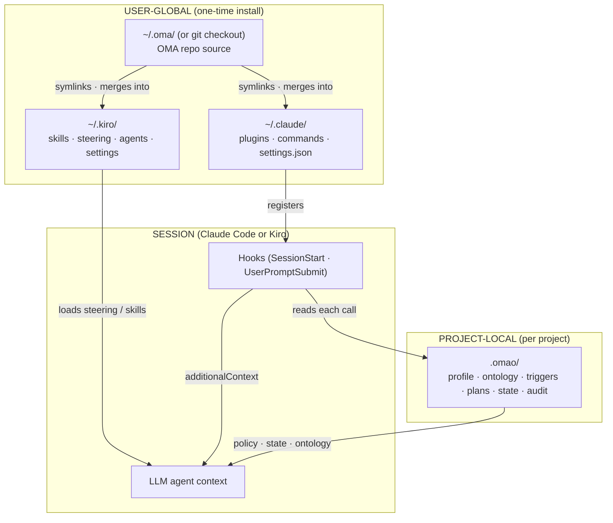
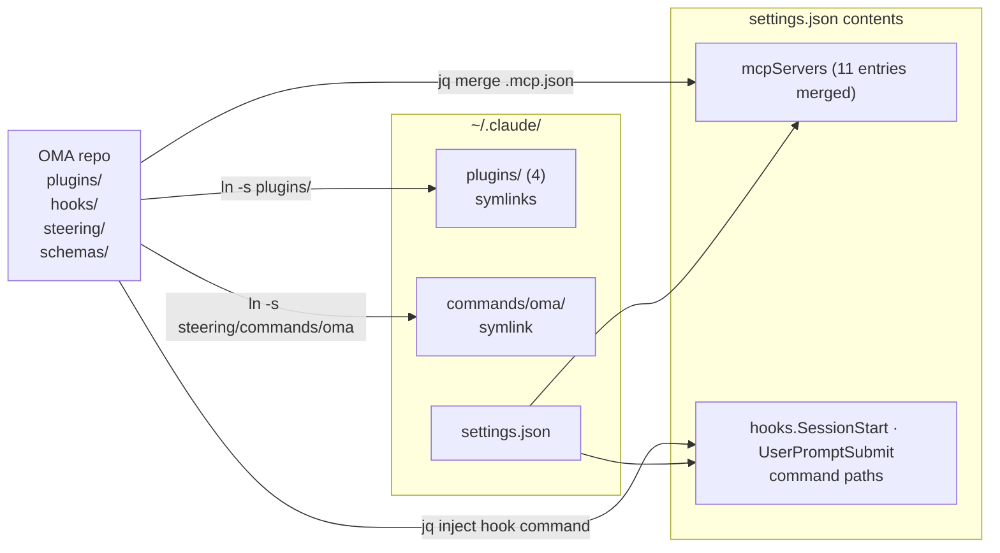
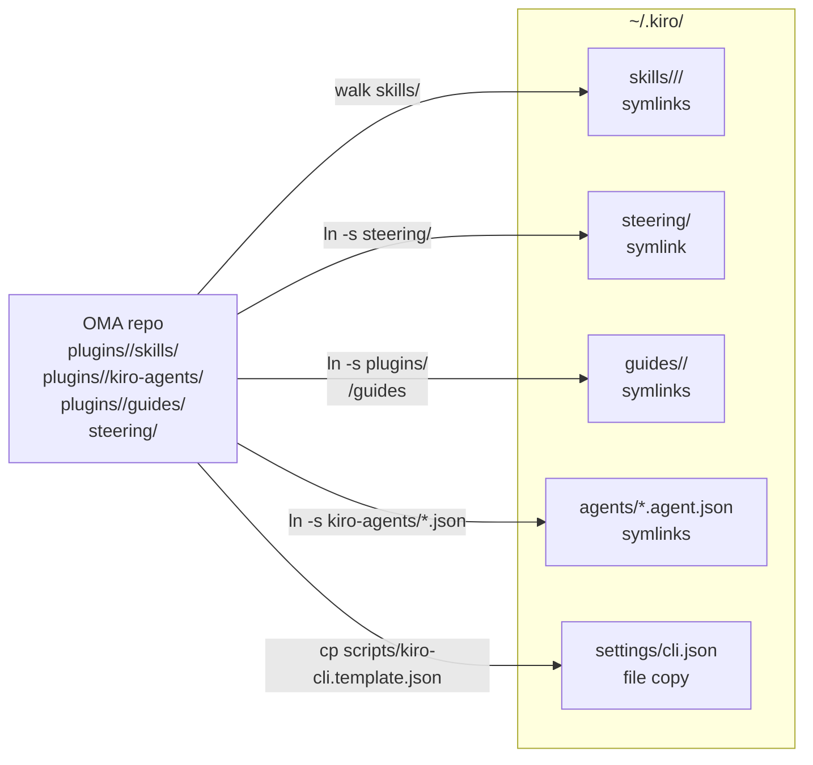
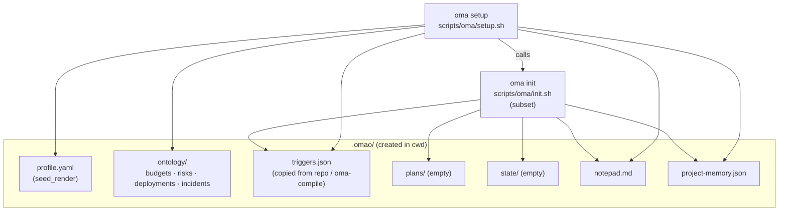
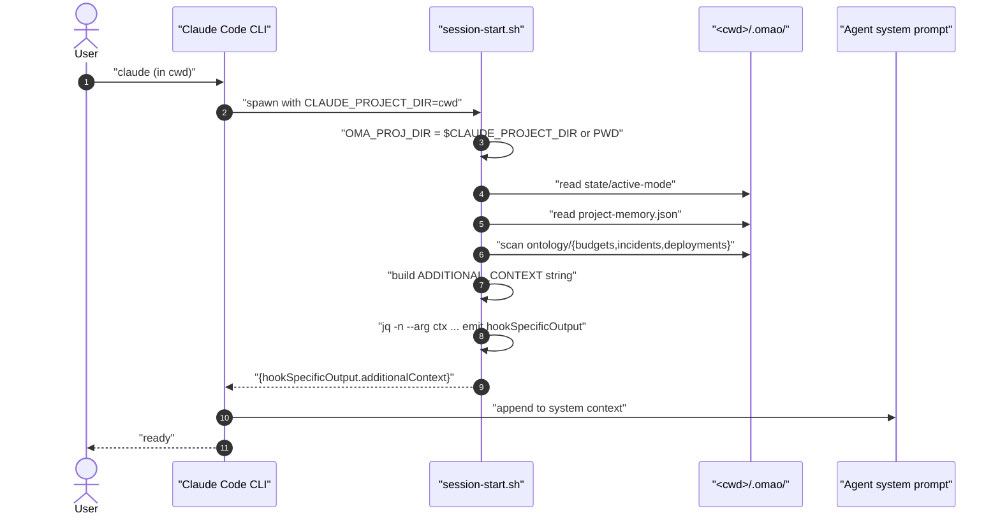
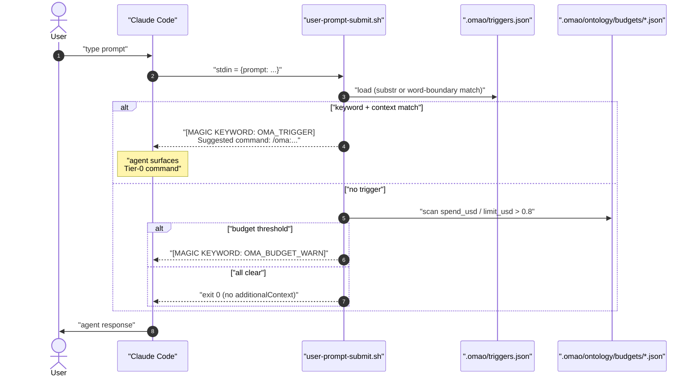
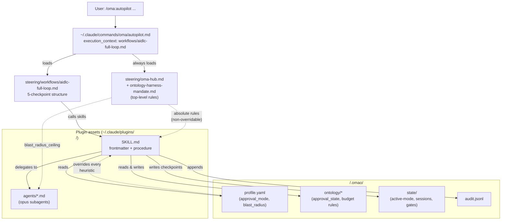
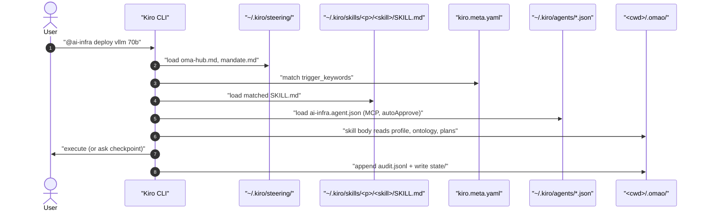

# Architecture — OMA 의 두 층 모델

이 문서는 **`oh-my-aidlcops` 가 사용자 PC 에 설치되는 구조**와 **Claude Code · Kiro 세션이 시작될 때 무엇이 일어나는지**를 한 화면에 정리한다. "어디를 고쳐야 어느 동작이 바뀌나" 를 즉시 찾을 수 있는 게 목표다.

다이어그램 라벨은 영어, 본문은 한국어로 통일했다. 신규 다이어그램은 [`steering/workflows/diagram-authoring-standard.md`](https://github.com/aws-samples/sample-oh-my-aidlcops/blob/main/steering/workflows/diagram-authoring-standard.md) 가 D2 / Diagrams / Excalidraw 를 강제하지만, Docusaurus 빌드 파이프라인이 아직 그 렌더러들과 연결돼 있지 않아 **인라인 mermaid 를 쓰되 모든 노드·엣지 라벨을 큰따옴표로 감쌌다**.

---

## TL;DR — 한 줄 모델

> **능력(capability) 은 user-global, 정책(policy) 은 project-local.**
>
> - `~/.claude/` · `~/.kiro/` 에는 *플러그인 · hook · MCP · 슬래시 명령* 이 한 번 등록된다 — 모든 프로젝트에서 같은 Capability.
> - `<project>/.omao/` 에는 *profile · ontology · triggers · plans · state · audit* 이 들어간다 — 프로젝트마다 다른 Policy.
> - hook 이 매 세션 · 매 프롬프트마다 cwd 의 `.omao/` 를 읽어 Claude / Kiro 시스템 컨텍스트에 **추가 메시지(`additionalContext`) 로 주입**한다.
>
> 세션을 변경하지 않고 컨텍스트만 누적한다는 점이 핵심이다. `.omao/` 가 없는 프로젝트에서는 hook 이 모두 no-op 으로 종료되고 사용자는 차이를 거의 느끼지 못한다.

---

## 1. 두 층 분리 — Layer overview



| 층 | 역할 | 변경 빈도 | 누가 만드나 |
| --- | --- | --- | --- |
| **`~/.oma/` 또는 `~/Dev/sample-oh-my-aidlcops/`** | OMA 코드 트리(플러그인 · 스킬 · hook 스크립트 · 컴파일러) | OMA 릴리스 시 | `install.sh` 또는 `git clone` |
| **`~/.claude/`** | Claude Code 가 읽는 user-global 설정 | OMA 설치 시 1 회 | [`scripts/install/claude.sh`](https://github.com/aws-samples/sample-oh-my-aidlcops/blob/main/scripts/install/claude.sh) 또는 `/plugin marketplace add` |
| **`~/.kiro/`** | Kiro 가 읽는 user-global 자산 | OMA 설치 시 1 회 | [`scripts/install/kiro.sh`](https://github.com/aws-samples/sample-oh-my-aidlcops/blob/main/scripts/install/kiro.sh) |
| **`<project>/.omao/`** | 그 프로젝트의 정책 · 상태 | 매 작업 | [`oma setup`](https://github.com/aws-samples/sample-oh-my-aidlcops/blob/main/scripts/oma/setup.sh) · [`oma init`](https://github.com/aws-samples/sample-oh-my-aidlcops/blob/main/scripts/oma/init.sh) · 각 skill |

---

## 2. 설치 시 무엇이 어디에 만들어지나 — Install layout

### 2.1 Claude Code 경로



`scripts/install/claude.sh` 가 실행하는 4 단계는 다음과 같다.

| Step | 함수 | 결과 |
| --- | --- | --- |
| 1 | `install_plugins` ([claude.sh:108](https://github.com/aws-samples/sample-oh-my-aidlcops/blob/main/scripts/install/claude.sh#L108)) | `~/.claude/plugins/<name>` 4 개 symlink |
| 2 | `install_commands` ([claude.sh:130](https://github.com/aws-samples/sample-oh-my-aidlcops/blob/main/scripts/install/claude.sh#L130)) | `~/.claude/commands/oma` symlink → `/oma:*` 슬래시 명령 활성 |
| 3 | `install_mcp_servers` ([claude.sh:143](https://github.com/aws-samples/sample-oh-my-aidlcops/blob/main/scripts/install/claude.sh#L143)) | 각 플러그인 `.mcp.json` 의 `mcpServers` 를 `~/.claude/settings.json` 에 jq merge (기존 키 보존) |
| 4 | `install_hooks` ([claude.sh:169](https://github.com/aws-samples/sample-oh-my-aidlcops/blob/main/scripts/install/claude.sh#L169)) | `~/.claude/settings.json` 의 `hooks.SessionStart` · `hooks.UserPromptSubmit` 에 OMA hook 스크립트 등록 |

Claude Code 2.0+ 의 native marketplace (`/plugin marketplace add ...`) 경로는 같은 결과를 만든다 — `~/.claude/plugins/cache/` 에 사본을 만들고 `~/.claude/installed_plugins.json` 에 기록한다는 점만 다르다.

### 2.2 Kiro 경로



`scripts/install/kiro.sh` 의 5 단계.

| Step | 함수 | 결과 |
| --- | --- | --- |
| 1 | `install_skills` ([kiro.sh:91](https://github.com/aws-samples/sample-oh-my-aidlcops/blob/main/scripts/install/kiro.sh#L91)) | `~/.kiro/skills/<plugin>/<skill>/` 평탄화 symlink. `aidlc/skills/inception/<skill>` 같은 2 단계 그룹은 한 단계 더 들어간다 |
| 2 | `install_steering` ([kiro.sh:145](https://github.com/aws-samples/sample-oh-my-aidlcops/blob/main/scripts/install/kiro.sh#L145)) | `~/.kiro/steering` → repo `steering/` (manifest · workflows · oma-hub.md) |
| 3 | `install_guides` ([kiro.sh:157](https://github.com/aws-samples/sample-oh-my-aidlcops/blob/main/scripts/install/kiro.sh#L157)) | 플러그인별 stage-gated guide 디렉터리 |
| 4 | `install_agents` ([kiro.sh:176](https://github.com/aws-samples/sample-oh-my-aidlcops/blob/main/scripts/install/kiro.sh#L176)) | Kiro `.agent.json` 프로파일 (MCP 매핑 + autoApprove) |
| 5 | `install_settings` ([kiro.sh:199](https://github.com/aws-samples/sample-oh-my-aidlcops/blob/main/scripts/install/kiro.sh#L199)) | `~/.kiro/settings/cli.json` 템플릿 복사 (이미 있으면 보존) |

Claude Code 와 달리 Kiro 는 **hook 스크립트를 사용하지 않는다**. Kiro 는 자체 엔진이 `kiro.meta.yaml` sidecar · `~/.kiro/agents/*.json` · `~/.kiro/steering/` 을 직접 해석한다. 즉 Kiro 에서는 "동적 정책 주입" 메커니즘이 hook 이 아니라 **Kiro 가 매 invocation 마다 자체적으로 steering / sidecar 를 다시 읽는 것** 이다.

### 2.3 프로젝트 초기화 (`oma setup` / `oma init`)



`oma setup` 은 8 step ([setup.sh](https://github.com/aws-samples/sample-oh-my-aidlcops/blob/main/scripts/oma/setup.sh)) — preflight · 7-Q wizard · profile.yaml 작성 · ontology seed · 하네스 install (위 2.1 / 2.2) · DSL compile · AWS credential sanity · doctor. 즉 `oma setup` 한 번이면 **user-global + project-local 양쪽 다 설정** 된다.

`oma init` 은 그 중 *project-local 부분만* 떼어 낸 진입점이다 — 이미 어느 프로젝트에서 한 번 setup 했다면 다른 프로젝트에서는 `oma init` 만으로 충분하다.

### 2.4 최종 디스크 레이아웃 한 장 요약

```text
~/.oma/                              # OMA 코드 본체 (install.sh) 또는 git checkout
  bin/oma                            # CLI dispatcher
  hooks/{session-start,user-prompt-submit}.sh
  plugins/{ai-infra,agenticops,aidlc,modernization}/
  steering/{commands/oma,workflows,oma-hub.md}
  schemas/{ontology,harness,profile,...}
  scripts/{install,oma,lib}/

~/.local/bin/oma           → ~/.oma/bin/oma            # PATH 진입점

~/.claude/                            # Claude Code (user-global)
  plugins/<plugin>/         → ~/.oma/plugins/<plugin>
  commands/oma/             → ~/.oma/steering/commands/oma
  settings.json             # mcpServers · hooks 가 in-place merge

~/.kiro/                              # Kiro (user-global)
  skills/<plugin>/<skill>/  → ~/.oma/plugins/<plugin>/skills/<skill>
  steering/                 → ~/.oma/steering
  guides/<plugin>/          → ~/.oma/plugins/<plugin>/guides
  agents/*.agent.json       → ~/.oma/plugins/<plugin>/kiro-agents/*.json
  settings/cli.json         # 템플릿 복사본 (사용자 편집 가능)

~/.aidlc/                             # 옵션 — aidlc-extensions.sh
  .git/                               # awslabs/aidlc-workflows clone
  aidlc-rules/aidlc-rule-details/extensions/
    *.opt-in.md             → ~/.oma/plugins/<plugin>/aidlc-rule-details/extensions/*

<project>/.omao/                      # 프로젝트마다 1 개
  profile.yaml                        # 7-Q wizard 결과
  ontology/{budgets,deployments,risks,incidents}/*.json
  triggers.json                       # repo 의 컴파일 산출물 사본
  plans/                              # AIDLC artefact (spec, design, ADR, stories)
  state/                              # active-mode, sessions, gates, audit/...
  audit.jsonl                         # schema-validated 감사 로그
  notepad.md
  project-memory.json
  permissions.yaml                    # 선택적 권한 overlay
```

---

## 3. 세션 시작 — Claude Code 의 SessionStart 흐름



`session-start.sh` 가 매 세션마다 emit 하는 컨텍스트의 구성 요소.

| 블록 | 출처 | 코드 위치 |
| --- | --- | --- |
| `[OMA Session Context] Active Tier-0 Mode: ...` | `cwd/.omao/state/active-mode` | [session-start.sh:25](https://github.com/aws-samples/sample-oh-my-aidlcops/blob/main/hooks/session-start.sh#L25) |
| `Project Memory: { ... }` | `cwd/.omao/project-memory.json` | [session-start.sh:39](https://github.com/aws-samples/sample-oh-my-aidlcops/blob/main/hooks/session-start.sh#L39) |
| `[OMA Ontology]` 한 줄씩 (Budget · Incident · Deployment) | `cwd/.omao/ontology/<type>/*.json` | [session-start.sh:53-87](https://github.com/aws-samples/sample-oh-my-aidlcops/blob/main/hooks/session-start.sh#L53-L87) |
| `Available OMA Tier-0 Commands: ...` (정적 카탈로그) | hardcoded | [session-start.sh:92](https://github.com/aws-samples/sample-oh-my-aidlcops/blob/main/hooks/session-start.sh#L92) |

**중요한 안전 장치**:
- `cwd` 가 아닌 `CLAUDE_PROJECT_DIR` 환경변수 우선 — Claude 가 다른 cwd 로 hook 을 띄워도 올바른 `.omao/` 를 읽는다 ([session-start.sh:20](https://github.com/aws-samples/sample-oh-my-aidlcops/blob/main/hooks/session-start.sh#L20)).
- JSON emit 은 `jq` 또는 `python3` 또는 `python` 셋 중 하나로 하고, 셋 다 없으면 `exit 1` ([session-start.sh:118-150](https://github.com/aws-samples/sample-oh-my-aidlcops/blob/main/hooks/session-start.sh#L118-L150)). 문자열 보간으로 JSON 을 만들지 않으므로 ontology 파일이 따옴표·백슬래시·줄바꿈을 포함해도 안전하다.
- Kill switch: `OMA_DISABLE_TRIGGERS=1` 또는 `OMA_DISABLE_ONTOLOGY=1` ([session-start.sh:12](https://github.com/aws-samples/sample-oh-my-aidlcops/blob/main/hooks/session-start.sh#L12) · [L53](https://github.com/aws-samples/sample-oh-my-aidlcops/blob/main/hooks/session-start.sh#L53)).

---

## 4. 매 프롬프트 — UserPromptSubmit 흐름



| 출력 | 트리거 조건 | 코드 위치 |
| --- | --- | --- |
| `[MAGIC KEYWORD: OMA_TRIGGER]` | `.omao/triggers.json` 의 keyword 가 prompt 에 매칭, 그리고 (있다면) `context_required` 모두 포함 | [user-prompt-submit.sh:55-124](https://github.com/aws-samples/sample-oh-my-aidlcops/blob/main/hooks/user-prompt-submit.sh#L55-L124) |
| `[MAGIC KEYWORD: OMA_BUDGET_WARN]` | 임의 budget 의 `spend_usd / limit_usd > 0.8` | [user-prompt-submit.sh:130-155](https://github.com/aws-samples/sample-oh-my-aidlcops/blob/main/hooks/user-prompt-submit.sh#L130-L155) |
| (없음) | 위 어느 것도 매칭 안 됨 — 일반 프롬프트로 통과 | `exit 0` |

매칭 규칙:
- 키워드가 슬래시 명령 (`/oma:agenticops`) 이거나 다중 단어이면 substring 매칭
- 단일 토큰이면 `grep -qw` 단어 경계 매칭 (예: `auto` 가 `automobile` 에 매칭하지 않음)
- 명시적 슬래시 명령 입력 시 `context_required` 우회

---

## 5. Tier-0 명령 집행 — 정적 자산 + 동적 정책의 합류

세션이 가동되면 사용자는 `/oma:autopilot` 같은 슬래시 명령을 호출한다. 이때부터 정적 자산 (플러그인 안의 SKILL.md · steering · agent.md) 과 동적 정책 (`.omao/`) 이 한 컨텍스트에서 만난다.



상위 위계는 `oma-hub.md` 와 `ontology-harness-mandate.md` 가 강제한다 ([steering/oma-hub.md:9-30](https://github.com/aws-samples/sample-oh-my-aidlcops/blob/main/steering/oma-hub.md#L9-L30) · [steering/workflows/ontology-harness-mandate.md:11-49](https://github.com/aws-samples/sample-oh-my-aidlcops/blob/main/steering/workflows/ontology-harness-mandate.md#L11-L49)) — 이 7 개 절대 규칙은 모든 SKILL.md 의 본문보다 **우선**한다.

---

## 6. 데이터 흐름 — 누가 무엇을 읽고 쓰는가

`.omao/` 안의 각 산출물은 producer 와 consumer 가 명확히 분리되어 있다. 수정하려면 이 표에서 producer 를 찾는다.

| `.omao/` 경로 | Producer | Consumer | Schema |
| --- | --- | --- | --- |
| `profile.yaml` | `oma setup` ([setup.sh:152](https://github.com/aws-samples/sample-oh-my-aidlcops/blob/main/scripts/oma/setup.sh#L152)) | 모든 SKILL · `oma doctor` · `enterprise-status` | [`schemas/profile/profile.schema.json`](https://github.com/aws-samples/sample-oh-my-aidlcops/blob/main/schemas/profile/profile.schema.json) |
| `ontology/budgets/*.json` | `oma setup` 시드 + finops 팀 수기 | `cost-governance` · `user-prompt-submit.sh` · `session-start.sh` | [`schemas/ontology/budget.schema.json`](https://github.com/aws-samples/sample-oh-my-aidlcops/blob/main/schemas/ontology/budget.schema.json) |
| `ontology/deployments/*.json` | `aidlc.code-generation` · `autopilot-deploy` | `incident-response` · strict-enterprise gate | `deployment.schema.json` |
| `ontology/incidents/*.json` | `agenticops.incident-response` | `session-start.sh` 스냅샷 · 사람 approver | `incident.schema.json` |
| `ontology/risks/*.json` | `aidlc.risk-discovery` · `modernization.risk-discovery` | `quality-gates` · strict-enterprise gate | `risk.schema.json` |
| `triggers.json` | `oma compile` ([tools/oma_compile/compile.py:41](https://github.com/aws-samples/sample-oh-my-aidlcops/blob/main/tools/oma_compile/compile.py#L41)) | `user-prompt-submit.sh` | [`schemas/harness/dsl.schema.json#triggers`](https://github.com/aws-samples/sample-oh-my-aidlcops/blob/main/schemas/harness/dsl.schema.json) |
| `plans/<slug>/*.md` | `aidlc.inception.*` · `aidlc.construction.*` | 사람 reviewer · 후속 skill | (자유 형식 + frontmatter) |
| `state/active-mode` | `/oma:autopilot` 등 진입 시 · `/oma:cancel` 시 비움 | `session-start.sh` · 다른 Tier-0 (중복 방지) | (단일 라인 텍스트) |
| `state/sessions/<id>/checkpoint.json` | `aidlc-full-loop` workflow | 사람 approver · 재시작 | (자유 형식) |
| `state/gates/<phase>.json` | `aidlc.quality-gates` | 하류 skill (`code-generation`, `autopilot-deploy`) | (자유 형식) |
| `audit.jsonl` | `tools/oma_audit/append.py` 또는 모든 skill 의 audit-trail 호출 | 감사자 · `enterprise-status` | [`schemas/audit/event.schema.json`](https://github.com/aws-samples/sample-oh-my-aidlcops/blob/main/schemas/audit/event.schema.json) |
| `permissions.yaml` | 사용자 수기 | `oma permissions show` · `claude install` 시 settings.json 머지 | (`templates/permissions/*.yaml` 참고) |

---

## 7. 어떤 동작을 바꾸려면 어디를 수정하나 — Modification map

| 바꾸고 싶은 동작 | 단일 편집 지점 | 후속 명령 |
| --- | --- | --- |
| MCP 서버 추가 / 버전 변경 | `plugins/<plugin>/<plugin>.oma.yaml` 의 `mcp:` 블록 | `python3 -m tools.oma_compile <file>` → `~/.claude/settings.json` 재머지(`bash scripts/install/claude.sh`) |
| 새 Kiro 에이전트 프로파일 | 같은 `<plugin>.oma.yaml` 의 `agents:` 블록 (runtime: kiro) | 위와 동일 — `kiro-agents/<id>.agent.json` 가 자동 재생성 |
| 새 키워드 트리거 | `<plugin>.oma.yaml` 의 `triggers:` 블록 | `oma compile` 후 `.omao/triggers.json` 사용자 프로젝트로 복사 |
| 새 Tier-0 슬래시 명령 | `steering/commands/oma/<name>.md` 추가 + `<plugin>.oma.yaml` triggers 업데이트 | symlink 가 이미 `~/.claude/commands/oma/` 를 가리키므로 재시작만 필요 |
| 새 SKILL | `plugins/<plugin>/skills/<skill>/SKILL.md` 추가 | Claude Code 는 즉시 인식. Kiro 는 `bash scripts/install/kiro.sh` 재실행 |
| 새 ontology entity | `schemas/ontology/<name>.schema.json` 추가 + `agent.schema.json#definitions/entityRef` enum 갱신 + producer skill 작성 | `oma validate` · CI `oma compile --check` 통과 |
| 절대 규칙 수정 | `steering/workflows/ontology-harness-mandate.md` | 변경 즉시 모든 세션의 hook 출력에 반영 (steering 은 매 세션 로드) |
| 세션 시작 컨텍스트 블록 추가 | `hooks/session-start.sh` 의 ADDITIONAL_CONTEXT 누적부 | `bash hooks/session-start.sh` 로 직접 출력 검증 |
| 프롬프트 매칭 규칙 변경 | `hooks/user-prompt-submit.sh` (예: 단어 경계) | `echo '{"prompt":"..."}' | bash hooks/user-prompt-submit.sh` |
| 7-Q wizard 의 기본값 / 항목 | `scripts/oma/setup.sh:113-137` (`ask` 호출들) + `templates/profile/profile.yaml.tmpl` | `OMA_NON_INTERACTIVE=1 oma setup --dry-run` |
| Doctor probe 추가 | `scripts/oma/doctor.sh` 의 `probe_*` 함수 + `bats tests/doctor` | `oma doctor` |
| Strict-enterprise 게이트 추가 | `tools/oma_compile/compile.py:308-369` (`enforce_strict_enterprise`) | `oma compile --strict-enterprise` |

---

## 8. Claude Code 와 Kiro 의 결정적 차이

| 측면 | Claude Code | Kiro |
| --- | --- | --- |
| **자산 등록 위치** | `~/.claude/plugins/<plugin>/` (플러그인 단위) | `~/.kiro/skills/<plugin>/<skill>/` (스킬 단위 평탄화) |
| **명령 호출** | `/oma:autopilot` 슬래시 명령 (`~/.claude/commands/oma/`) | 직접 스킬 호출 (`@ai-infra ...`) — 슬래시 명령 없음 |
| **MCP 등록** | `~/.claude/settings.json` 의 `mcpServers` 에 머지 | `~/.kiro/agents/<name>.agent.json` 안에 인-프로파일 |
| **자동 권한** | (사용자 settings.json + permissions overlay) | 각 agent.json 의 `autoApprove` 블록 |
| **세션 시작 컨텍스트 주입** | `SessionStart` hook 이 `additionalContext` 를 emit | Kiro 가 매 invocation 마다 steering / sidecar 직접 재로드 |
| **키워드 트리거** | `UserPromptSubmit` hook + `.omao/triggers.json` | `kiro.meta.yaml` 의 `trigger_keywords` (Kiro 엔진 처리) |
| **공유 자원** | 둘 다 `<project>/.omao/` 를 동일하게 읽고 쓴다 — harness 사이 작업이 끊기지 않음 | 동일 |
| **동적 정책 주입 메커니즘** | hook 이 stdout 으로 `additionalContext` 를 emit → Claude Code 가 시스템 프롬프트에 append | Kiro 자체 엔진이 `~/.kiro/steering/` · `kiro.meta.yaml` 을 매번 참조 |

### Kiro 측 흐름



핵심: **Kiro 의 동적 정책 주입은 hook 없이도 일어난다**. Claude Code 의 hook 이 하던 역할을 Kiro 엔진의 steering 자동 로드 + sidecar 매칭이 대신한다.

---

## 9. 검증 — 동작 확인 명령

```bash
# 0. CLI / 플러그인 / hook 가 다 박혔는지
oma doctor                                         # 12 probes
ls ~/.claude/plugins ~/.claude/commands/oma        # 4 + 1
jq '.hooks | keys, .mcpServers | keys' ~/.claude/settings.json

# 1. SessionStart hook 이 무엇을 emit 하나
echo '{}' | bash hooks/session-start.sh | jq '.hookSpecificOutput.additionalContext' -r

# 2. UserPromptSubmit hook 이 키워드를 잡나
echo '{"prompt":"please run agenticops on this"}' | bash hooks/user-prompt-submit.sh | \
  jq '.hookSpecificOutput.additionalContext' -r

# 3. .omao/ ontology 가 schema 와 일치하나
python3 - <<'PY'
import json, pathlib
from jsonschema import Draft7Validator
root = pathlib.Path(".omao/ontology/budgets")
schema = json.loads(pathlib.Path("schemas/ontology/budget.schema.json").read_text())
for p in root.glob("*.json"):
    errs = list(Draft7Validator(schema).iter_errors(json.loads(p.read_text())))
    print(p, "OK" if not errs else errs)
PY

# 4. 컴파일 산출물이 DSL 과 동기화돼 있나
python3 -m tools.oma_compile --check

# 5. 트리거 카탈로그
jq '.triggers[] | {id, keywords, command}' .omao/triggers.json

# 6. Kiro 환경
ls ~/.kiro/skills ~/.kiro/agents ~/.kiro/steering
```

---

## 10. 흔한 함정

- **`~/.claude/` 가 비어 보임** — `oma setup` 을 했지만 `claude.sh` 가 같이 안 돌았을 가능성. `bash scripts/install/claude.sh` 를 직접 한 번 돌리면 4 개 plugin · commands/oma · mcpServers · hooks 가 모두 박힌다.
- **Hook 이 두 번 등록됨** — `~/.oma` 와 `~/Dev/.../sample-oh-my-aidlcops` 양쪽에서 install 한 흔적. `jq '.hooks' ~/.claude/settings.json` 으로 확인 후 중복 제거.
- **`.omao/` 가 없는 프로젝트에서 hook 동작이 어색해 보임** — 정상이다. hook 의 모든 `[[ -f ... ]]` 가드가 false 로 떨어져 정적 카탈로그만 emit 된다 ([session-start.sh:25,39,53](https://github.com/aws-samples/sample-oh-my-aidlcops/blob/main/hooks/session-start.sh#L25)). `oma init` 으로 `.omao/` 를 만들면 동작이 활성화된다.
- **MCP 서버 버전이 안 보임** — `.mcp.json` 은 컴파일 산출물이다. 직접 편집하지 말고 `<plugin>.oma.yaml` 을 고친 뒤 `oma compile`. CI ([`.github/workflows/oma-foundation.yml`](https://github.com/aws-samples/sample-oh-my-aidlcops/blob/main/.github/workflows/oma-foundation.yml)) 가 drift 를 차단한다.
- **트리거가 안 잡힘** — `.omao/triggers.json` 누락이거나 `OMA_DISABLE_TRIGGERS=1` 환경변수가 켜져 있다. `env | grep OMA_DISABLE` 로 확인.
- **Kiro 에서 SKILL 이 안 보임** — Kiro 는 평탄화 구조라 2 단계 그룹 (`aidlc/skills/inception/<skill>`) 을 직접 인식하지 못한다. `kiro.sh` 의 `install_skills` 가 그걸 풀어 주지만 — 만약 직접 추가했다면 `bash scripts/install/kiro.sh` 재실행 필요 ([kiro.sh:108-141](https://github.com/aws-samples/sample-oh-my-aidlcops/blob/main/scripts/install/kiro.sh#L108-L141)).

---

## 참고 자료

### OMA 내부 문서

- [Claude Code Setup](./claude-code-setup.md) — `~/.claude/` 설치 절차의 1차 레퍼런스
- [Kiro Setup](./kiro-setup.md) — `~/.kiro/` 설치와 sidecar 메커니즘
- [Keyword Triggers](./keyword-triggers.md) — `UserPromptSubmit` hook 동작 상세
- [Profile](./profile.md) — `.omao/profile.yaml` 의 모든 필드 의미
- [Ontology](./ontology.md) — 8 entity 와 traceability chain
- [Harness DSL](./harness-dsl.md) — `<plugin>.oma.yaml` 작성법
- [Tier-0 Workflows](./tier-0-workflows.md) — `/oma:*` 명령 카탈로그
- [`steering/oma-hub.md`](https://github.com/aws-samples/sample-oh-my-aidlcops/blob/main/steering/oma-hub.md) — 라우팅 허브 (절대 규칙 7 개 포함)
- [`steering/workflows/ontology-harness-mandate.md`](https://github.com/aws-samples/sample-oh-my-aidlcops/blob/main/steering/workflows/ontology-harness-mandate.md) — 비-override 절대 규칙 본문
- [`steering/workflows/diagram-authoring-standard.md`](https://github.com/aws-samples/sample-oh-my-aidlcops/blob/main/steering/workflows/diagram-authoring-standard.md) — 본 문서가 mermaid 를 사용한 이유와 라벨 규칙

### 핵심 소스

- [`hooks/session-start.sh`](https://github.com/aws-samples/sample-oh-my-aidlcops/blob/main/hooks/session-start.sh) · [`hooks/user-prompt-submit.sh`](https://github.com/aws-samples/sample-oh-my-aidlcops/blob/main/hooks/user-prompt-submit.sh)
- [`scripts/install/claude.sh`](https://github.com/aws-samples/sample-oh-my-aidlcops/blob/main/scripts/install/claude.sh) · [`scripts/install/kiro.sh`](https://github.com/aws-samples/sample-oh-my-aidlcops/blob/main/scripts/install/kiro.sh)
- [`scripts/oma/setup.sh`](https://github.com/aws-samples/sample-oh-my-aidlcops/blob/main/scripts/oma/setup.sh) · [`scripts/oma/init.sh`](https://github.com/aws-samples/sample-oh-my-aidlcops/blob/main/scripts/oma/init.sh)
- [`tools/oma_compile/compile.py`](https://github.com/aws-samples/sample-oh-my-aidlcops/blob/main/tools/oma_compile/compile.py) · [`tools/oma_audit/append.py`](https://github.com/aws-samples/sample-oh-my-aidlcops/blob/main/tools/oma_audit/append.py)
