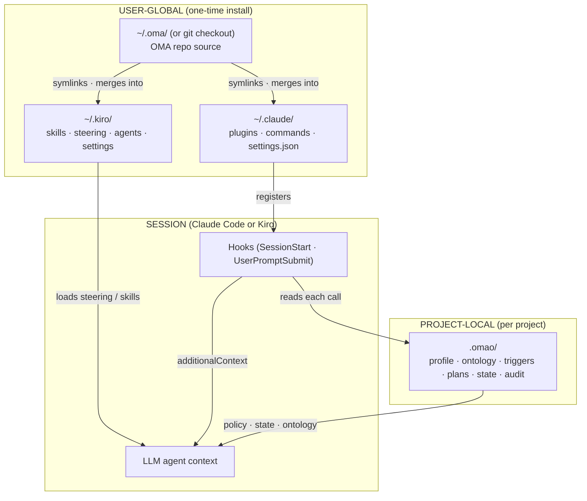
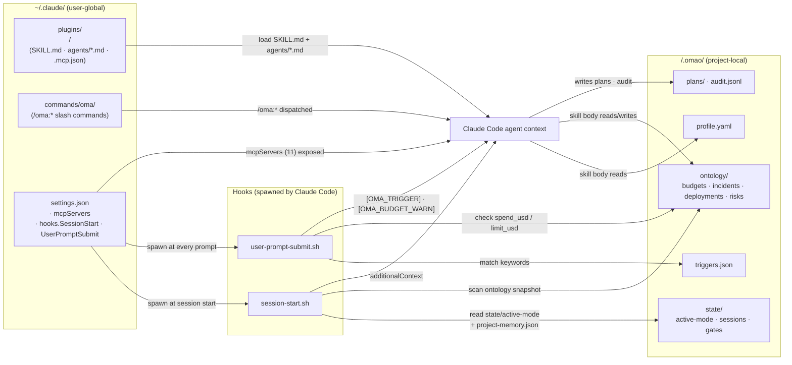
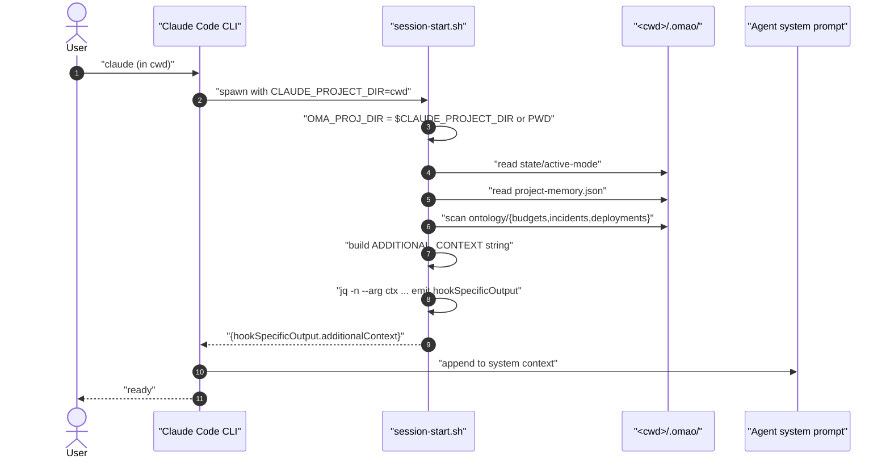
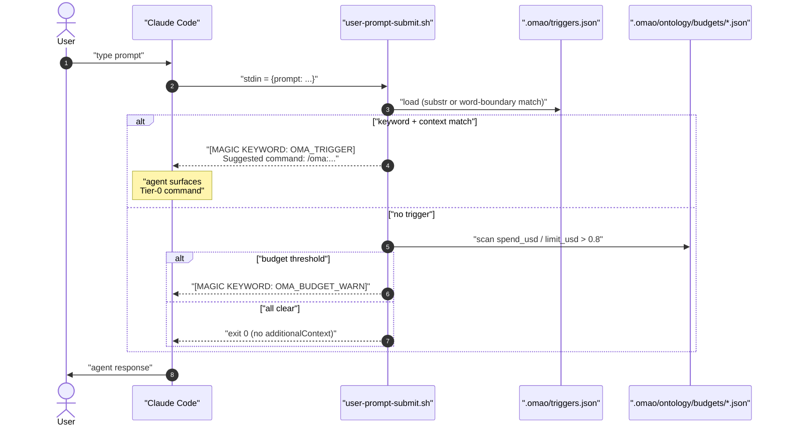
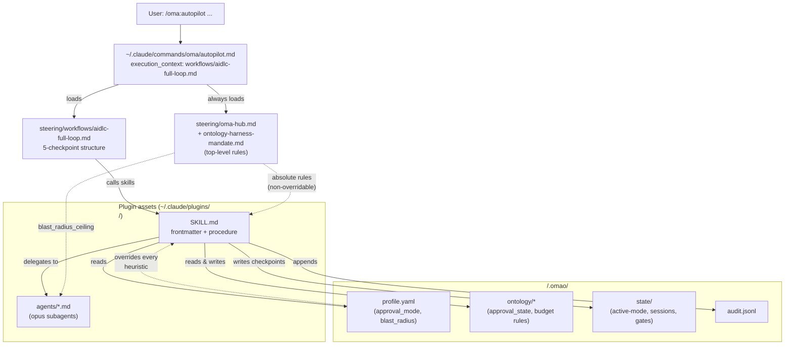
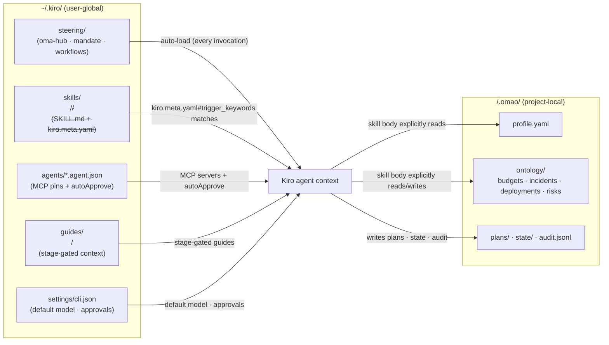

# Architecture — OMA 의 두 층 모델

이 문서는 **`oh-my-aidlcops` 가 사용자 PC 에 설치되는 구조** 와 **Claude Code · Kiro 세션이 시작될 때 무엇이 일어나는지** 를 한 화면에 정리한다. "어디를 고쳐야 어느 동작이 바뀌나" 를 즉시 찾을 수 있는 게 목표다.

## 핵심 모델 — 세 가지 사실

OMA 아키텍처는 다음 세 문장으로 압축된다. 본 문서의 §1 · §2 · §3 가 각 문장 하나에 대응한다.

1. **자산은 두 층으로 나뉜다.** OMA repo (`~/.oma/` 또는 git checkout) 의 자산은 설치 시 한 번 user-global 디렉터리(`~/.claude/` 또는 `~/.kiro/`) 로 symlink · merge 된다. 사용자가 작업하는 프로젝트마다 별도로 `<project>/.omao/` 가 만들어지고 *그 프로젝트의 정책과 상태만* 들어간다. 즉 **능력(capability) 은 user-global, 정책(policy) 은 project-local**.

2. **두 하네스는 정책을 가져오는 방식이 다르다.**
   - **Claude Code** 는 능동적(active). `~/.claude/settings.json` 에 등록된 hook 이 매 세션·매 프롬프트마다 cwd 의 `.omao/` 를 읽어 `additionalContext` JSON 으로 시스템 컨텍스트에 주입한다.
   - **Kiro** 는 선언적(declarative). hook 이 없는 대신 엔진이 매 invocation 마다 `~/.kiro/steering/` · `kiro.meta.yaml` · `agents/*.json` 을 재로드하고, SKILL 본문이 필요한 시점에 `.omao/` 를 명시적으로 Read 한다.

3. **`.omao/` 는 두 하네스의 공통 표면이다.** 한 프로젝트에서 Claude Code 와 Kiro 를 번갈아 써도 작업이 끊기지 않는다 — 둘 다 같은 `profile.yaml` · `ontology/` · `plans/` · `state/` · `audit.jsonl` 을 같은 컨벤션으로 읽고 쓰기 때문이다. 단, hook 부재로 인한 비대칭이 존재한다 (§2.6 참조).

세션을 변경하지 않고 컨텍스트만 누적한다는 점이 양쪽 모두의 안전 장치다. `.omao/` 가 없는 프로젝트에서는 Claude Code hook 이 모두 no-op 으로 종료되고 Kiro 도 정책 값 없이 정적 자산만으로 동작한다.

## 본 문서가 다루는 것 — 개요 그래프



이 다이어그램이 본 문서의 뼈대다. 각 화살표가 어떻게 동작하는지를 두 하네스로 나누어 §1 (Claude Code) 과 §2 (Kiro) 에서 상세화하고, 공통 부분을 §3 에서 정리한다.

| 층 | 역할 | 변경 빈도 | 누가 만드나 |
| --- | --- | --- | --- |
| **`~/.oma/` 또는 `~/Dev/sample-oh-my-aidlcops/`** | OMA 코드 트리(플러그인 · 스킬 · hook 스크립트 · 컴파일러) | OMA 릴리스 시 | `install.sh` 또는 `git clone` |
| **`~/.claude/`** | Claude Code 가 읽는 user-global 설정 | OMA 설치 시 1 회 | [`scripts/install/claude.sh`](https://github.com/aws-samples/sample-oh-my-aidlcops/blob/main/scripts/install/claude.sh) 또는 `/plugin marketplace add` |
| **`~/.kiro/`** | Kiro 가 읽는 user-global 자산 | OMA 설치 시 1 회 | [`scripts/install/kiro.sh`](https://github.com/aws-samples/sample-oh-my-aidlcops/blob/main/scripts/install/kiro.sh) |
| **`<project>/.omao/`** | 그 프로젝트의 정책 · 상태 | 매 작업 | [`oma setup`](https://github.com/aws-samples/sample-oh-my-aidlcops/blob/main/scripts/oma/setup.sh) · [`oma init`](https://github.com/aws-samples/sample-oh-my-aidlcops/blob/main/scripts/oma/init.sh) · 각 skill |

본 문서의 흐름:

1. **§1 Claude Code 하네스** — settings.json 에 박힌 hook 이 `.omao/` 를 어떻게 매 호출마다 컨텍스트로 변환하는지.
2. **§2 Kiro 하네스** — hook 없이 steering · sidecar · agent profile 이 어떻게 정책 *규칙* 을 매 invocation 마다 다시 가져오는지.
3. **§3 공통 — `<project>/.omao/`** — 두 하네스가 공유하는 정책 표면. producer / consumer 매핑과 수정 지점.

---

## 1. Claude Code 하네스

Claude Code 의 핵심은 **hook 스크립트가 stdout 으로 `additionalContext` JSON 을 emit 해서 시스템 프롬프트에 누적시키는 능동적(active) 모델** 이다. 정적 자산(plugins · commands · MCP) 은 `~/.claude/settings.json` 으로 노출되고, 동적 정책(`.omao/`) 은 hook 이 매 세션 · 매 프롬프트마다 직접 읽는다.

### 1.1 자산이 무엇을 바라보나



다이어그램의 각 화살표가 의미하는 코드 위치를 §1.2~§1.6 에서 상세화한다.

### 1.2 Install — `~/.claude/` 가 어떻게 만들어지나

[`scripts/install/claude.sh`](https://github.com/aws-samples/sample-oh-my-aidlcops/blob/main/scripts/install/claude.sh) 가 4 단계로 user-global 자산을 박는다. native marketplace 경로 (`/plugin marketplace add ...`) 도 같은 결과를 만든다 — `~/.claude/plugins/cache/` 에 사본이 생기고 `~/.claude/installed_plugins.json` 에 기록된다는 점만 다르다.

| Step | 함수 | 결과 | 다이어그램 노드 |
| --- | --- | --- | --- |
| 1 | `install_plugins` ([claude.sh:108](https://github.com/aws-samples/sample-oh-my-aidlcops/blob/main/scripts/install/claude.sh#L108)) | `~/.claude/plugins/<name>/` 4 개 symlink → SOURCE `plugins/<name>/` | `PLUG` |
| 2 | `install_commands` ([claude.sh:130](https://github.com/aws-samples/sample-oh-my-aidlcops/blob/main/scripts/install/claude.sh#L130)) | `~/.claude/commands/oma/` symlink → SOURCE `steering/commands/oma/` | `CMD` |
| 3 | `install_mcp_servers` ([claude.sh:143](https://github.com/aws-samples/sample-oh-my-aidlcops/blob/main/scripts/install/claude.sh#L143)) | 각 플러그인 `.mcp.json` 의 `mcpServers` 를 `~/.claude/settings.json` 에 jq merge (기존 키 보존) | `SET#mcpServers` |
| 4 | `install_hooks` ([claude.sh:169](https://github.com/aws-samples/sample-oh-my-aidlcops/blob/main/scripts/install/claude.sh#L169)) | `~/.claude/settings.json` 의 `hooks.SessionStart` · `hooks.UserPromptSubmit` 에 hook 스크립트 경로 등록 | `SET#hooks` |

설치 결과:

```text
~/.claude/
  plugins/<plugin>/         → SOURCE/plugins/<plugin>            # PLUG (symlink)
  commands/oma/             → SOURCE/steering/commands/oma       # CMD  (symlink)
  settings.json
    "mcpServers": { aws-documentation, aws-iac, aws-pricing, ... } # 11 entries (SET#mcp)
    "hooks": {
      "SessionStart":      [{ "hooks": [{"command": "SOURCE/hooks/session-start.sh"}]}],
      "UserPromptSubmit":  [{ "hooks": [{"command": "SOURCE/hooks/user-prompt-submit.sh"}]}]
    }
```

### 1.3 SessionStart hook — 세션 시작 시 컨텍스트 주입

`SET → SS → ST · ONT → AGENT` 화살표의 상세.



매 세션 시작 시 emit 되는 컨텍스트 블록.

| 블록 | 출처 | 코드 위치 |
| --- | --- | --- |
| `[OMA Session Context] Active Tier-0 Mode: ...` | `cwd/.omao/state/active-mode` | [session-start.sh:25](https://github.com/aws-samples/sample-oh-my-aidlcops/blob/main/hooks/session-start.sh#L25) |
| `Project Memory: { ... }` | `cwd/.omao/project-memory.json` | [session-start.sh:39](https://github.com/aws-samples/sample-oh-my-aidlcops/blob/main/hooks/session-start.sh#L39) |
| `[OMA Ontology]` 한 줄씩 (Budget · Incident · Deployment) | `cwd/.omao/ontology/<type>/*.json` | [session-start.sh:53-87](https://github.com/aws-samples/sample-oh-my-aidlcops/blob/main/hooks/session-start.sh#L53-L87) |
| `Available OMA Tier-0 Commands: ...` (정적 카탈로그) | hardcoded | [session-start.sh:92](https://github.com/aws-samples/sample-oh-my-aidlcops/blob/main/hooks/session-start.sh#L92) |

안전 장치:
- **cwd 가 아닌 `CLAUDE_PROJECT_DIR` 우선** — Claude 가 다른 cwd 로 hook 을 띄워도 올바른 `.omao/` 를 읽는다 ([session-start.sh:20](https://github.com/aws-samples/sample-oh-my-aidlcops/blob/main/hooks/session-start.sh#L20)).
- **JSON emit 은 `jq` / `python3` / `python` 셋 중 하나** — 셋 다 없으면 `exit 1`. 문자열 보간으로 JSON 을 만들지 않으므로 ontology 파일이 따옴표·백슬래시·줄바꿈을 포함해도 안전 ([session-start.sh:118-150](https://github.com/aws-samples/sample-oh-my-aidlcops/blob/main/hooks/session-start.sh#L118-L150)).
- **Kill switch** — `OMA_DISABLE_TRIGGERS=1` 또는 `OMA_DISABLE_ONTOLOGY=1` 환경변수 ([session-start.sh:12,53](https://github.com/aws-samples/sample-oh-my-aidlcops/blob/main/hooks/session-start.sh#L12)).

### 1.4 UserPromptSubmit hook — 매 프롬프트마다 키워드·예산 검사

`SET → UPS → TRIG · ONT → AGENT` 화살표의 상세.



| 출력 | 트리거 조건 | 코드 위치 |
| --- | --- | --- |
| `[MAGIC KEYWORD: OMA_TRIGGER]` | `.omao/triggers.json` 의 keyword 가 prompt 에 매칭 + (있다면) `context_required` 모두 포함 | [user-prompt-submit.sh:55-124](https://github.com/aws-samples/sample-oh-my-aidlcops/blob/main/hooks/user-prompt-submit.sh#L55-L124) |
| `[MAGIC KEYWORD: OMA_BUDGET_WARN]` | 임의 budget 의 `spend_usd / limit_usd > 0.8` | [user-prompt-submit.sh:130-155](https://github.com/aws-samples/sample-oh-my-aidlcops/blob/main/hooks/user-prompt-submit.sh#L130-L155) |
| (없음) | 어느 것도 매칭 안 됨 — 일반 프롬프트로 통과 | `exit 0` |

매칭 규칙:
- 키워드가 슬래시 명령(`/oma:agenticops`) 이거나 다중 단어이면 substring 매칭
- 단일 토큰이면 `grep -qw` 단어 경계 매칭 (예: `auto` 가 `automobile` 에 매칭하지 않음)
- 명시적 슬래시 명령 입력 시 `context_required` 우회

### 1.5 Tier-0 명령 집행 — 정적 자산 + 동적 정책의 합류

세션이 가동되면 사용자는 `/oma:autopilot` 같은 슬래시 명령을 호출한다. 이때부터 정적 자산(`PLUG`, `CMD`) 과 동적 정책(`PROF`, `ONT`, `ST`) 이 한 컨텍스트에서 만난다.



상위 위계는 [`steering/oma-hub.md:9-30`](https://github.com/aws-samples/sample-oh-my-aidlcops/blob/main/steering/oma-hub.md#L9-L30) 과 [`steering/workflows/ontology-harness-mandate.md:11-49`](https://github.com/aws-samples/sample-oh-my-aidlcops/blob/main/steering/workflows/ontology-harness-mandate.md#L11-L49) 가 강제한다 — 이 7 개 절대 규칙은 모든 SKILL.md 의 본문보다 **우선** 한다.

### 1.6 Claude Code 측에서 무엇을 고치면 무엇이 바뀌나

| 바꾸고 싶은 동작 | 단일 편집 지점 | 후속 명령 |
| --- | --- | --- |
| MCP 서버 추가 / 버전 변경 | `plugins/<plugin>/<plugin>.oma.yaml` 의 `mcp:` 블록 | `python3 -m tools.oma_compile <file>` → `bash scripts/install/claude.sh` 재머지 |
| 새 키워드 트리거 | `<plugin>.oma.yaml` 의 `triggers:` 블록 | `oma compile` 후 `.omao/triggers.json` 사용자 프로젝트로 복사 |
| 새 Tier-0 슬래시 명령 | `steering/commands/oma/<name>.md` 추가 + `<plugin>.oma.yaml#triggers` 업데이트 | symlink 가 이미 `~/.claude/commands/oma/` 를 가리키므로 재시작만 필요 |
| 새 SKILL | `plugins/<plugin>/skills/<skill>/SKILL.md` 추가 | Claude Code 는 즉시 인식 (symlink) |
| 세션 시작 컨텍스트 블록 추가 | `hooks/session-start.sh` 의 ADDITIONAL_CONTEXT 누적부 | `bash hooks/session-start.sh` 로 직접 출력 검증 |
| 프롬프트 매칭 규칙 변경 | `hooks/user-prompt-submit.sh` (단어 경계 등) | `echo '{"prompt":"..."}' \| bash hooks/user-prompt-submit.sh` |

---

## 2. Kiro 하네스

Kiro 는 **hook 이 없다**. Claude Code 가 hook 으로 능동적으로 컨텍스트를 emit 하는 모델이라면, Kiro 는 엔진이 매 invocation 마다 `~/.kiro/steering/` · `kiro.meta.yaml` · `agents/*.json` 을 *직접 다시 읽는* declarative 모델이다. SKILL 본문이 필요할 때 `.omao/` 를 명시적으로 Read 한다.

### 2.1 자산이 무엇을 바라보나



다이어그램의 각 화살표가 의미하는 코드 위치를 §2.2~§2.5 에서 상세화한다.

### 2.2 Install — `~/.kiro/` 가 어떻게 만들어지나

[`scripts/install/kiro.sh`](https://github.com/aws-samples/sample-oh-my-aidlcops/blob/main/scripts/install/kiro.sh) 의 5 단계. **hook 등록 단계가 없다** — 이게 Claude Code 와의 결정적 차이.

| Step | 함수 | 결과 | 다이어그램 노드 |
| --- | --- | --- | --- |
| 1 | `install_skills` ([kiro.sh:91](https://github.com/aws-samples/sample-oh-my-aidlcops/blob/main/scripts/install/kiro.sh#L91)) | `~/.kiro/skills/<p>/<s>/` 평탄화 symlink. `aidlc/skills/inception/<s>` 같은 2 단계 그룹은 한 단계 더 들어간다 | `SK` |
| 2 | `install_steering` ([kiro.sh:145](https://github.com/aws-samples/sample-oh-my-aidlcops/blob/main/scripts/install/kiro.sh#L145)) | `~/.kiro/steering` → SOURCE `steering/` (manifest · workflows · oma-hub.md) | `ST` |
| 3 | `install_guides` ([kiro.sh:157](https://github.com/aws-samples/sample-oh-my-aidlcops/blob/main/scripts/install/kiro.sh#L157)) | 플러그인별 stage-gated guide 디렉터리 | `GD` |
| 4 | `install_agents` ([kiro.sh:176](https://github.com/aws-samples/sample-oh-my-aidlcops/blob/main/scripts/install/kiro.sh#L176)) | Kiro `.agent.json` 프로파일 (MCP 핀 + `autoApprove`) | `AG` |
| 5 | `install_settings` ([kiro.sh:199](https://github.com/aws-samples/sample-oh-my-aidlcops/blob/main/scripts/install/kiro.sh#L199)) | `~/.kiro/settings/cli.json` 템플릿 복사 (이미 있으면 보존) | `CFG` |

설치 결과:

```text
~/.kiro/
  skills/<plugin>/<skill>/  → SOURCE/plugins/<plugin>/skills/<skill>     # SK  (symlink)
  steering/                 → SOURCE/steering                            # ST  (symlink)
  guides/<plugin>/          → SOURCE/plugins/<plugin>/guides             # GD  (symlink)
  agents/*.agent.json       → SOURCE/plugins/<plugin>/kiro-agents/*.json # AG  (symlink)
  settings/cli.json         (file copy from scripts/kiro-cli.template.json) # CFG
```

### 2.3 Steering 자동 로드 — 절대 규칙 주입

`ST → AGENT` 화살표.

Kiro 엔진은 `~/.kiro/steering/` 디렉터리 내용을 매 invocation 마다 자동으로 컨텍스트에 로드한다. 결과적으로 다음 두 절대 규칙 묶음이 모든 Kiro 세션에 항상 박혀 있다:

- [`oma-hub.md`](https://github.com/aws-samples/sample-oh-my-aidlcops/blob/main/steering/oma-hub.md) — 라우팅 허브 + 7 개 ABSOLUTE RULES
- [`workflows/ontology-harness-mandate.md`](https://github.com/aws-samples/sample-oh-my-aidlcops/blob/main/steering/workflows/ontology-harness-mandate.md) — 비-override 절대 규칙 본문
- [`workflows/diagram-authoring-standard.md`](https://github.com/aws-samples/sample-oh-my-aidlcops/blob/main/steering/workflows/diagram-authoring-standard.md) — 다이어그램 도구 강제
- `workflows/aidlc-full-loop.md`, `workflows/platform-bootstrap.md`, ... — 5-checkpoint 워크플로우 정의
- `commands/oma/*.md` — Kiro 는 슬래시 명령으로 dispatch 하지 않지만, 파일 본문을 skill orchestration 참고 자료로 사용

이 부분이 Claude Code 의 SessionStart hook 의 *규칙 측* 기능과 동등하다 — 차이는 다음 §2.6 에서 정리한다.

### 2.4 SKILL 매칭 — sidecar trigger_keywords

`SK → AGENT` 화살표.

각 SKILL 디렉터리에는 `kiro.meta.yaml` sidecar 가 함께 들어 있을 수 있다 ([kiro-setup.md:98-134](https://github.com/aws-samples/sample-oh-my-aidlcops/blob/main/docs/docs/kiro-setup.md#L98-L134) 참조). Kiro 엔진이 이 sidecar 를 읽어 자연어 입력을 SKILL 에 자동 매칭한다.

```yaml
# kiro.meta.yaml — vllm-serving-setup 예
kiro:
  trigger_keywords:
    - "vllm"
    - "model serving"
    - "PagedAttention"
  context_files:
    - SKILL.md
    - reference/vllm-config.yaml
  mcp_required:
    - eks-mcp-server
    - aws-pricing-mcp-server
  phase: operations
  approval_required: true
```

| 필드 | 효과 |
| --- | --- |
| `trigger_keywords` | 자연어 매칭 시 우선순위 부여 |
| `context_files` | SKILL 실행 시 함께 로드할 보조 파일 |
| `mcp_required` | 실행 전 필요 MCP 서버 연결 검증 |
| `phase` | Inception / Construction / Operations 분류 |
| `approval_required` | checkpoint 승인 필요 여부 |

Sidecar 가 없는 SKILL 도 SKILL.md frontmatter 만으로 정상 동작한다.

### 2.5 Agent profile — `agents/*.agent.json`

`AG → AGENT` 화살표.

각 Kiro agent profile 은 [`tools/oma_compile`](https://github.com/aws-samples/sample-oh-my-aidlcops/blob/main/tools/oma_compile/compile.py) 가 SOURCE 의 `<plugin>.oma.yaml#agents` 에서 컴파일해 만든 결과물이다. **Claude Code 가 settings.json 한 곳에 11 개 MCP 서버를 모으는 것과 달리, Kiro 는 agent 마다 자체 MCP 핀을 가진다**.

```json
// ~/.kiro/agents/ai-infra.agent.json — symlink → SOURCE/plugins/ai-infra/kiro-agents/...
{
  "name": "ai-infra",
  "description": "AI runtime infrastructure architect ...",
  "tools": ["*"],
  "mcpServers": {
    "awslabs.eks-mcp-server":            { "command": "uvx", "args": ["awslabs.eks-mcp-server==0.1.28"], ... },
    "awslabs.aws-documentation-mcp-server": { ... },
    "awslabs.aws-pricing-mcp-server":    { ... },
    "awslabs.cloudwatch-mcp-server":     { ... }
  },
  "autoApprove": { "readOnly": true, "fileWrites": false, "bashCommands": false },
  "resources": ["file://.kiro/steering/oma-hub.md", "skill://.kiro/skills/ai-infra/**/*.md"]
}
```

런타임에서 `@ai-infra deploy vllm 70b` 같이 활성화한다.

### 2.6 Kiro 의 비대칭 — hook 부재가 만드는 갭

Claude Code 의 hook 이 능동적으로 박아 주던 정보 중 **Kiro 에서는 자동으로 박히지 않는 것** 이 있다. 운영자는 이 갭을 인지하고 SKILL 절차에서 명시 Read 로 보완해야 한다.

| 컨텍스트 | Claude Code | Kiro |
| --- | --- | --- |
| **Steering 절대 규칙** (`oma-hub.md`, `mandate.md`) | hook 없이도 Claude Code 가 자동 로드 | `~/.kiro/steering/` 자동 로드 ✅ |
| **SKILL 본문** | `~/.claude/plugins/<p>/skills/<s>/SKILL.md` | `~/.kiro/skills/<p>/<s>/SKILL.md` ✅ |
| **MCP 서버 카탈로그** | `settings.json#mcpServers` 전역 | agent profile 인-프로파일 ✅ |
| **온톨로지 *현재 값* 스냅샷** (Budget 잔액, 열린 incident, draft deployment) | `session-start.sh` 가 매 세션 시작에 push ✅ | ❌ 자동 push 없음. SKILL 본문이 명시 Read 필요 |
| **active-mode / project-memory** | `session-start.sh` 가 push ✅ | ❌ 자동 push 없음 |
| **매 프롬프트 budget 임계 경고** (`[OMA_BUDGET_WARN]`) | `user-prompt-submit.sh` 가 매번 검사 ✅ | ❌ 매 프롬프트 자동 검사 없음 |
| **키워드 트리거** (자연어 → Tier-0 명령) | `user-prompt-submit.sh` + `.omao/triggers.json` 전역 카탈로그 ✅ | △ `kiro.meta.yaml#trigger_keywords` 가 *SKILL 매칭* 만 처리 (Tier-0 카탈로그 없음) |

함의:
- Kiro 사용자가 `@ai-infra deploy ...` 를 띄울 때 에이전트는 *현재 예산이 80% 도달했는지·draft deployment 가 있는지* 를 **모르는 상태로 시작** 한다. SKILL 절차가 명시적으로 `.omao/ontology/budgets/*.json` · `.omao/ontology/deployments/*.json` 을 Read 해야 비로소 본다.
- [`steering/workflows/ontology-harness-mandate.md`](https://github.com/aws-samples/sample-oh-my-aidlcops/blob/main/steering/workflows/ontology-harness-mandate.md) 의 절대 규칙 4 — *"`[MAGIC KEYWORD: OMA_BUDGET_WARN]` 수신 시 첫 응답에서 경고를 명시한다"* — 는 Claude Code 전제다. Kiro 에서는 매직 키워드가 emit 되지 않으므로 규칙이 자동으로 비활성된다. 운영 차원에서는 `cost-governance` skill 을 명시 호출하거나 `kiro.meta.yaml#context_files` 에 budget 파일을 등록하는 우회가 필요하다.

### 2.7 Kiro 측에서 무엇을 고치면 무엇이 바뀌나

| 바꾸고 싶은 동작 | 단일 편집 지점 | 후속 명령 |
| --- | --- | --- |
| Kiro agent 의 MCP 핀 / 권한 | `<plugin>.oma.yaml` 의 `agents:` 블록 (runtime: kiro) | `python3 -m tools.oma_compile <file>` → `bash scripts/install/kiro.sh` 재실행 (symlink 갱신) |
| 새 Kiro 에이전트 프로파일 | 같은 곳 — agent id · description · tools · mcp · resources | 위와 동일 — `kiro-agents/<id>.agent.json` 가 자동 재생성 |
| SKILL 의 trigger_keywords | 해당 SKILL 디렉터리의 `kiro.meta.yaml` (없으면 신규 작성) | symlink 가 이미 가리키므로 재시작만 필요 |
| 절대 규칙 / 새 워크플로우 정의 | `steering/oma-hub.md` 또는 `steering/workflows/<name>.md` | 즉시 모든 Kiro 세션에 반영 (steering 자동 로드) |
| 새 SKILL | `plugins/<plugin>/skills/<skill>/` (SKILL.md + 옵션으로 kiro.meta.yaml) | `bash scripts/install/kiro.sh` 재실행 (skill symlink 추가) |
| Kiro 기본 모델 / autoApprove 정책 | `~/.kiro/settings/cli.json` (사용자 편집 가능 — 1 회 복사본) | Kiro 재시작 |
| stage-gated 가이드 추가 | `plugins/<plugin>/guides/stages/<stage>.md` | symlink 가 이미 가리키므로 즉시 반영 |

---

## 3. 공통 — `<project>/.omao/`

두 하네스가 공유하는 정책 표면이다. 같은 프로젝트에서 Claude Code 와 Kiro 를 번갈아 써도 작업이 끊기지 않는 이유는 둘 다 `.omao/` 를 동일한 컨벤션으로 읽고 쓰기 때문이다.

### 3.1 디스크 레이아웃

```text
<project>/.omao/
  profile.yaml                        # 7-Q wizard 결과 (oma setup)
  ontology/{budgets,deployments,risks,incidents}/*.json
  triggers.json                       # repo 의 컴파일 산출물 사본
  plans/                              # AIDLC artefact (spec, design, ADR, stories)
  state/                              # active-mode, sessions, gates, audit/...
  audit.jsonl                         # schema-validated 감사 로그
  notepad.md
  project-memory.json
  permissions.yaml                    # 선택적 권한 overlay
```

`oma setup` ([scripts/oma/setup.sh](https://github.com/aws-samples/sample-oh-my-aidlcops/blob/main/scripts/oma/setup.sh)) 한 번이면 user-global (`~/.claude/` 또는 `~/.kiro/`) 과 project-local (`.omao/`) 양쪽이 모두 설정된다. 다른 프로젝트에서는 `oma init` 만 돌리면 `.omao/` 만 새로 만들어진다.

### 3.2 producer / consumer 매핑

각 산출물은 producer 와 consumer 가 명확히 분리되어 있다. 수정하려면 이 표에서 producer 를 찾는다.

| `.omao/` 경로 | Producer | Consumer | Schema |
| --- | --- | --- | --- |
| `profile.yaml` | `oma setup` ([setup.sh:152](https://github.com/aws-samples/sample-oh-my-aidlcops/blob/main/scripts/oma/setup.sh#L152)) | 모든 SKILL · `oma doctor` · `enterprise-status` | [`schemas/profile/profile.schema.json`](https://github.com/aws-samples/sample-oh-my-aidlcops/blob/main/schemas/profile/profile.schema.json) |
| `ontology/budgets/*.json` | `oma setup` 시드 + finops 팀 수기 | `cost-governance` · Claude `user-prompt-submit.sh` · `session-start.sh` | [`budget.schema.json`](https://github.com/aws-samples/sample-oh-my-aidlcops/blob/main/schemas/ontology/budget.schema.json) |
| `ontology/deployments/*.json` | `aidlc.code-generation` · `autopilot-deploy` | `incident-response` · strict-enterprise gate | `deployment.schema.json` |
| `ontology/incidents/*.json` | `agenticops.incident-response` | Claude `session-start.sh` 스냅샷 · 사람 approver | `incident.schema.json` |
| `ontology/risks/*.json` | `aidlc.risk-discovery` · `modernization.risk-discovery` | `quality-gates` · strict-enterprise gate | `risk.schema.json` |
| `triggers.json` | `oma compile` ([compile.py:41](https://github.com/aws-samples/sample-oh-my-aidlcops/blob/main/tools/oma_compile/compile.py#L41)) | Claude `user-prompt-submit.sh` (Kiro 는 sidecar 사용) | `dsl.schema.json#triggers` |
| `plans/<slug>/*.md` | `aidlc.inception.*` · `aidlc.construction.*` | 사람 reviewer · 후속 skill | (자유 형식) |
| `state/active-mode` | Tier-0 진입 시 · `/oma:cancel` 시 비움 | Claude `session-start.sh` · 다른 Tier-0 (중복 방지) | (단일 라인) |
| `state/sessions/<id>/checkpoint.json` | `aidlc-full-loop` workflow | 사람 approver · 재시작 | (자유 형식) |
| `state/gates/<phase>.json` | `aidlc.quality-gates` | 하류 skill | (자유 형식) |
| `audit.jsonl` | [`tools/oma_audit/append.py`](https://github.com/aws-samples/sample-oh-my-aidlcops/blob/main/tools/oma_audit/append.py) 또는 audit-trail skill | 감사자 · `oma enterprise-status` | [`event.schema.json`](https://github.com/aws-samples/sample-oh-my-aidlcops/blob/main/schemas/audit/event.schema.json) |
| `permissions.yaml` | 사용자 수기 (overlay) | `oma permissions resolve` → **`~/.claude/settings.json#permissions`** 에 머지 (Claude 전용 — Kiro 는 §3.3 참조) | (`.omao/permissions.yaml` 헤더 코멘트의 resolution chain 참고) |

### 3.3 Permission 표면 — Claude 와 Kiro 가 다르다

권한 설정은 두 하네스가 처리 방식이 결정적으로 다르다. 한 표로 비교:

| 측면 | Claude Code | Kiro |
| --- | --- | --- |
| **소스 (사용자 편집 지점)** | `<project>/.omao/permissions.yaml` (overlay, optional) + SOURCE `templates/permissions/{common,<env>}.yaml` (baseline) | ① `~/.kiro/settings/cli.json#autoApprove` (CLI 전체) ② `<plugin>.oma.yaml#agents[].autoApprove` → 컴파일 → `kiro-agents/<a>.agent.json#autoApprove` (agent 별) |
| **Resolution chain** | `common.yaml` → `<env>.yaml` → `.omao/permissions.yaml` (lowest → highest priority) | (chain 없음 — CLI 와 agent 가 독립적으로 적용) |
| **적용 위치 (런타임이 읽는 곳)** | **`~/.claude/settings.json#permissions.{allow,deny}`** (user-global, in-place merge) | ① `~/.kiro/settings/cli.json` (user-global, **첫 install 1 회 복사 후 사용자 편집**) ② `~/.kiro/agents/<a>.agent.json` (user-global, symlink → SOURCE) |
| **반영 트리거** | `oma setup` 또는 `bash scripts/install/claude.sh` (overlay 변경 시 재실행 필요) | CLI: 즉시 (Kiro 가 매 invocation 마다 cli.json 재로드). Agent: `<plugin>.oma.yaml` 편집 → `oma compile` → `bash scripts/install/kiro.sh` 재실행 |
| **`<project>/.omao/permissions.yaml` 의 효과** | ✅ 자동 머지됨 | ❌ **머지되지 않음** — `kiro.sh` 의 `install_settings` 는 cli.json 을 1 회 복사만 하고 `.omao/permissions.yaml` 을 보지 않는다 ([kiro.sh:199-216](https://github.com/aws-samples/sample-oh-my-aidlcops/blob/main/scripts/install/kiro.sh#L199-L216)) |
| **권한 단위** | 패턴 기반 `allow` / `deny` 리스트 (예: `Bash(git *)`, `Edit(infra/secrets/**)`) | boolean 토글 (`readOnly` · `fileWrites` · `bashCommands`) |

**함의 — Kiro 운영자가 알아야 할 갭**:

- `<project>/.omao/permissions.yaml` 에 적은 deny 패턴은 Claude 에서만 enforce 된다. 같은 프로젝트를 Kiro 로 띄우면 그 deny 가 **무시된다**.
- Kiro 측 권한을 프로젝트별로 격리하려면 다음 중 하나를 선택:
  1. `~/.kiro/settings/cli.json` 을 사용자가 직접 편집 (전역이라 다른 프로젝트에도 영향)
  2. SKILL 별 권한이 필요하면 `<plugin>.oma.yaml#agents[].autoApprove` 를 고치고 `oma compile` (agent 단위로 격리)
  3. `kiro.meta.yaml#approval_required: true` 로 SKILL 마다 사람 승인 강제 (편집 지점은 SKILL 디렉터리)
- OMA 의 `.omao/permissions.yaml` 컨벤션은 **Claude 측 권한 표준화** 를 위한 것이다 — Kiro 측 권한 통합은 [`.omao/permissions.yaml`](https://github.com/aws-samples/sample-oh-my-aidlcops/blob/main/.omao/permissions.yaml) 의 헤더 코멘트가 *"push the change into `~/.claude/settings.json` and `~/.kiro/`"* 라고 적었지만 현재 install 스크립트가 후자를 구현하지 않은 상태다 (Kiro 측 `permissions` 스키마 부재).

요약: **`<project>/.claude/` 또는 `<project>/.kiro/` 에 권한 파일을 만들 필요는 없다**. OMA 컨벤션의 권한 편집 지점은 다음 셋뿐:
- Claude 권한 → `<project>/.omao/permissions.yaml`
- Kiro CLI 권한 → `~/.kiro/settings/cli.json`
- Kiro agent 별 권한 → `<plugin>.oma.yaml#agents[].autoApprove`

(Claude Code 자체가 자동 생성하는 `<project>/.claude/settings.local.json` 은 사용자가 IDE 에서 "이 명령 허용" 을 누를 때 누적되는 별도 파일로, OMA 가 관리하지 않는다.)

---

## 참고 자료

### OMA 내부 문서

- [Claude Code Setup](./claude-code-setup.md) — `~/.claude/` 설치 절차의 1차 레퍼런스
- [Kiro Setup](./kiro-setup.md) — `~/.kiro/` 설치와 sidecar 메커니즘
- [Keyword Triggers](./keyword-triggers.md) — `UserPromptSubmit` hook 동작 상세
- [Profile](./profile.md) — `.omao/profile.yaml` 의 모든 필드 의미
- [Ontology](./ontology.md) — 8 entity 와 traceability chain
- [Harness DSL](./harness-dsl.md) — `<plugin>.oma.yaml` 작성법
- [Tier-0 Workflows](./tier-0-workflows.md) — `/oma:*` 명령 카탈로그
- [`steering/oma-hub.md`](https://github.com/aws-samples/sample-oh-my-aidlcops/blob/main/steering/oma-hub.md) — 라우팅 허브 (절대 규칙 7 개 포함)
- [`steering/workflows/ontology-harness-mandate.md`](https://github.com/aws-samples/sample-oh-my-aidlcops/blob/main/steering/workflows/ontology-harness-mandate.md) — 비-override 절대 규칙 본문
- [`steering/workflows/diagram-authoring-standard.md`](https://github.com/aws-samples/sample-oh-my-aidlcops/blob/main/steering/workflows/diagram-authoring-standard.md) — 다이어그램 도구 강제

### 핵심 소스

- [`hooks/session-start.sh`](https://github.com/aws-samples/sample-oh-my-aidlcops/blob/main/hooks/session-start.sh) · [`hooks/user-prompt-submit.sh`](https://github.com/aws-samples/sample-oh-my-aidlcops/blob/main/hooks/user-prompt-submit.sh)
- [`scripts/install/claude.sh`](https://github.com/aws-samples/sample-oh-my-aidlcops/blob/main/scripts/install/claude.sh) · [`scripts/install/kiro.sh`](https://github.com/aws-samples/sample-oh-my-aidlcops/blob/main/scripts/install/kiro.sh)
- [`scripts/oma/setup.sh`](https://github.com/aws-samples/sample-oh-my-aidlcops/blob/main/scripts/oma/setup.sh) · [`scripts/oma/init.sh`](https://github.com/aws-samples/sample-oh-my-aidlcops/blob/main/scripts/oma/init.sh)
- [`tools/oma_compile/compile.py`](https://github.com/aws-samples/sample-oh-my-aidlcops/blob/main/tools/oma_compile/compile.py) · [`tools/oma_audit/append.py`](https://github.com/aws-samples/sample-oh-my-aidlcops/blob/main/tools/oma_audit/append.py)
