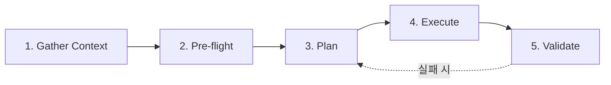

본 문서는 `oh-my-aidlcops`(OMA)를 처음 사용하는 사용자를 위한 5분 Quickstart입니다. Claude Code 환경을 전제로 설명하지만, Kiro 환경도 흐름은 동일합니다(커맨드 대신 `.kiro/skills/` 심링크를 통해 호출). Kiro 전용 절차는 [Kiro Setup](./kiro-setup.md)을 참조합니다.

## 사전 요구사항

| 항목 | 버전 | 비고 |
|---|---|---|
| Claude Code CLI | 최신 stable | `claude --version` |
| jq | 1.6+ | 설치 스크립트가 JSON 병합에 사용 |
| bash | 4+ | macOS 기본 bash 3.2는 `brew install bash` 권장 |
| AWS 자격 증명 | — | `agentic-platform` 워크플로우에서 EKS·CloudWatch·S3 접근 필요 |
| (선택) Kubernetes CLI | kubectl v1.32+ | `platform-bootstrap` 실행 시 |

## ⚡ 한 줄 설치 (권장 — Tech Preview)

가장 빠른 경로는 `install.sh` + `oma setup` + `oma doctor` 세 줄입니다.

```bash
curl -fsSL https://raw.githubusercontent.com/aws-samples/sample-oh-my-aidlcops/v0.2.0-preview.1/install.sh | bash
cd my-project
oma setup
oma doctor
```

위 세 줄이 끝나면 `.omao/profile.yaml` + `.omao/ontology/*` 이 생성되고,
Claude Code / Kiro 플러그인·MCP·훅 설치까지 완료됩니다. 상세 동작은
[Easy Button](./easy-button.md) 을 참조하세요.

> 기본값 그대로 설치하려면 모든 질문에서 ENTER 를 눌러 넘어가면 됩니다.
> CI 에서는 `OMA_NON_INTERACTIVE=1` 과 env flag 로 비대화식 설치가 가능합니다.

## 1단계 · 마켓플레이스 등록 (30초)

Claude Code를 실행한 뒤 네이티브 플러그인 커맨드를 입력합니다.

```bash
claude
> /plugin marketplace add https://github.com/aws-samples/sample-oh-my-aidlcops
> /plugin install agentic-platform agenticops aidlc-inception aidlc-construction
```

설치 후 다음을 확인합니다.

```bash
> /plugin list
# 네 개의 플러그인이 activated 상태로 표시되어야 합니다.
```

네이티브 마켓플레이스가 불가하거나 오프라인 환경이라면 수동 설치도 가능합니다.

```bash
git clone https://github.com/aws-samples/sample-oh-my-aidlcops
bash oh-my-aidlcops/scripts/install/claude.sh
```

수동 설치 상세는 [Claude Code Setup](./claude-code-setup.md)을 참조합니다.

## 2단계 · 프로젝트 초기화 (10초)

OMA는 프로젝트별 상태를 `.omao/` 디렉터리에 보관합니다. 작업 프로젝트 루트에서 다음을 실행합니다.

```bash
cd <your-project>
bash <oma-repo>/scripts/init-omao.sh
```

생성되는 구조는 다음과 같습니다.

```
.omao/
├── plans/                # AIDLC 산출물 (spec, design, ADR, user stories)
├── state/                # 세션 체크포인트, 활성 Tier-0 모드
├── notepad.md            # 작업 메모
├── triggers.json         # 키워드 트리거 카탈로그 (SessionStart 훅이 읽음)
└── project-memory.json   # 프로젝트별 영속 컨텍스트
```

`.omao/`는 harness-agnostic 하므로 Claude Code와 Kiro가 같은 파일을 공유합니다.

## 3단계 · 첫 Tier-0 실행 (2분)

가장 가벼운 워크플로우인 `/oma:aidlc-loop`로 시작합니다. 단일 feature의 AIDLC 1회전을 수행합니다.

```bash
> /oma:aidlc-loop "사용자 인증 로그에 이상 패턴 감지 룰을 추가하라"
```

에이전트는 다음 순서로 진행합니다.

1. **Inception** — `.omao/plans/` 안에 `spec.md`, `user-stories.md`를 생성합니다.
2. **Checkpoint 1** — 요구사항 검토를 위한 승인 프롬프트가 나타납니다. 내용을 확인하고 `approve` 또는 `revise` 응답합니다.
3. **Construction** — 승인 후 `design.md`, `adr-<topic>.md`, 테스트 전략, 구현 diff를 차례로 생성합니다.
4. **Checkpoint 2** — 설계·구현 리뷰 체크포인트. 여기서도 승인·수정이 가능합니다.
5. **Operations 설정** — 배포 후 지속 모니터링을 위해 `agenticops` 플러그인이 Langfuse 트레이스 훅을 등록합니다.

## 4단계 · 체크포인트 구조 이해 (1분)

OMA의 체크포인트는 [aws-samples/sample-apex-skills](https://github.com/aws-samples/sample-apex-skills)의 5단계 템플릿을 따릅니다.



각 단계는 `.omao/state/checkpoint-<n>.json`에 결과를 저장합니다. 중단 후 재개가 가능하며, 롤백은 `.omao/state/` 스냅샷을 복원하는 방식으로 수행합니다.

## 5단계 · 자율 실행 모드 전환 (1분)

단일 회전이 아닌 전체 루프 자동화를 원한다면 `/oma:autopilot`을 사용합니다.

```bash
> /oma:autopilot "신규 API 엔드포인트 /v1/events/anomaly 를 기획부터 운영까지 끝까지 완성하라"
```

`autopilot`은 Inception·Construction·Operations를 연속 실행하며, 체크포인트에서만 사용자 승인을 요구합니다. 운영 단계에서는 `continuous-eval`·`incident-response`·`cost-governance` 세 스킬이 백그라운드로 활성화됩니다.

중단하려면 언제든 다음을 호출합니다.

```bash
> /oma:cancel
```

## 결과 확인

Quickstart 완료 후 다음 산출물이 생성됩니다.

- `.omao/plans/spec.md` — 요구사항 명세
- `.omao/plans/design.md` — 컴포넌트 설계
- `.omao/plans/adr-*.md` — 아키텍처 결정 기록
- 소스 코드 변경사항 (feature branch에 커밋)
- `.omao/state/session-<id>/` — 세션 로그·체크포인트 결과

## 트러블슈팅 요약

| 증상 | 원인 | 해결 |
|---|---|---|
| `/plugin marketplace add` 실패 | Claude Code 버전 미지원 | `claude --version` 후 업그레이드 |
| `jq: command not found` | jq 미설치 | `brew install jq` / `apt install jq` |
| `/oma:*` 커맨드 미노출 | `~/.claude/commands/oma/` 심링크 실패 | `bash scripts/install/claude.sh` 재실행 |
| MCP 서버 연결 실패 | `uvx` 미설치 또는 네트워크 이슈 | `pipx install uv` 후 재시도 |
| Checkpoint가 무한 대기 | 훅 등록 누락 | [Claude Code Setup](./claude-code-setup.md)의 훅 섹션 참조 |

더 상세한 트러블슈팅은 [Claude Code Setup](./claude-code-setup.md)의 해당 섹션을 참조합니다.

## 다음 단계

- [Easy Button](./easy-button.md) — `oma setup` 1 회 실행으로 완료되는 설치·프로파일·씨드 온톨로지 흐름
- [Profile](./profile.md) · [Doctor](./doctor.md) — 프로젝트 설정과 환경 점검 참고
- [Ontology](./ontology.md) · [Harness DSL](./harness-dsl.md) — 런타임 강제화되는 도메인 계약과 DSL
- [Philosophy](./philosophy-aidlc-meets-agenticops.md) — OMA 설계 명제 이해
- [Tier-0 Workflows](./tier-0-workflows.md) — 9개 Tier-0 커맨드 심화 학습
- [Keyword Triggers](./keyword-triggers.md) — 키워드 기반 자동 커맨드 호출 설정
- [Support Policy](./support-policy.md) · [Telemetry](./telemetry.md) — Tech Preview 지원 범위

## 참고 자료

### 공식 문서
- [Claude Code Plugins](https://docs.anthropic.com/claude/docs/claude-code-plugins) — Claude Code 플러그인 공식 가이드
- [awslabs/aidlc-workflows](https://github.com/awslabs/aidlc-workflows) — AIDLC core workflow 저장소

### OMA 내부 문서
- [Introduction](./intro.md) — OMA 개요와 플러그인 카탈로그
- [Claude Code Setup](./claude-code-setup.md) — 수동 설치와 훅 설정
- [Tier-0 Workflows](./tier-0-workflows.md) — 커맨드 상세 레퍼런스
