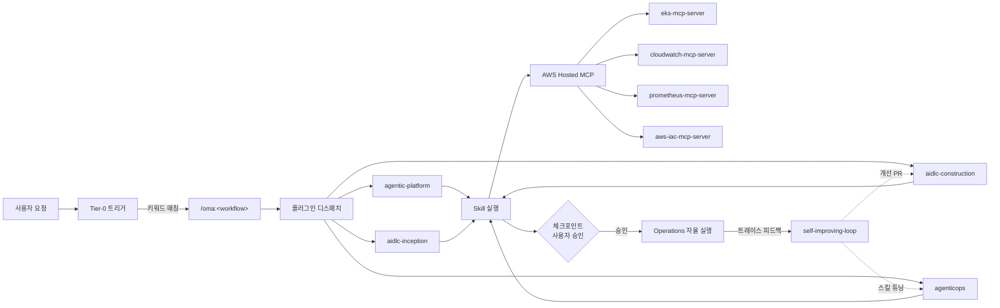

`oh-my-aidlcops`(OMA)는 AIDLC(AI-Driven Development Lifecycle)의 전 단계(Inception → Construction → Operations)를 에이전트 기반 운영 자동화로 연결하는 **플러그인 마켓플레이스**입니다. OMA는 [oh-my-claudecode](https://github.com/Atom-oh/oh-my-claudecode)(OMC)의 형제 프로젝트이며, 범용 Claude Code 오케스트레이션 철학을 AIDLC 전용 도메인으로 확장합니다. 핵심 명제는 단순합니다 — **AIDLC는 운영이 에이전트로 자동화되었을 때 비로소 완성됩니다.**

## 한 문단 요약

AWS 공식 [awslabs/aidlc-workflows](https://github.com/awslabs/aidlc-workflows)는 기획·설계·구현 단계를 체계화합니다. OMA는 여기에 **AgenticOps** 레이어(자기개선 피드백 루프, 자율 배포, 지속 평가, 인시던트 대응, 비용 거버넌스)를 결합해 라이프사이클이 사람의 단계별 실행 없이 스스로 닫히도록 구성합니다. 사용자는 체크포인트에서만 승인하고, 에이전트가 진단·제안·실행을 담당합니다.

## 플러그인 카탈로그

| 플러그인 | 역할 | 예시 스킬 |
|---|---|---|
| `agentic-platform` | EKS 위 Agentic AI Platform 구축·운영 | `agentic-eks-bootstrap`, `vllm-serving-setup`, `inference-gateway-routing`, `langfuse-observability`, `gpu-resource-management`, `ai-gateway-guardrails` |
| `agenticops` | 에이전트 기반 운영 자동화 | `self-improving-loop`, `autopilot-deploy`, `incident-response`, `continuous-eval`, `cost-governance` |
| `aidlc-inception` | AIDLC Phase 1 확장 (opt-in) | `workspace-detection`, `requirements-analysis`, `user-stories`, `workflow-planning` |
| `aidlc-construction` | AIDLC Phase 2 확장 (opt-in) | `component-design`, `code-generation`, `test-strategy` |

플러그인 상세 정의는 리포지터리 루트의 [`.claude-plugin/marketplace.json`](https://github.com/devfloor9/oh-my-aidlcops/blob/main/.claude-plugin/marketplace.json)에 있습니다.

## Tier-0 워크플로우

Tier-0는 한 번의 호출로 전체 흐름을 시작하고, 체크포인트에서만 사용자 승인을 요구하는 고레버리지 워크플로우입니다.

| 커맨드 | 목적 |
|---|---|
| `/oma:autopilot` | AIDLC 전체 루프 자율 실행 (Inception → Construction → Operations) |
| `/oma:aidlc-loop` | 단일 feature AIDLC 1회전 |
| `/oma:inception` | Phase 1 단독 실행 |
| `/oma:construction` | Phase 2 단독 실행 |
| `/oma:agenticops` | 운영 모드 (continuous-eval + incident-response + cost-governance 동시 구동) |
| `/oma:self-improving` | Langfuse 트레이스 → skill·prompt 개선 PR 피드백 루프 |
| `/oma:platform-bootstrap` | EKS 위 Agentic AI Platform 5단계 체크포인트 구축 |
| `/oma:review` | AIDLC artifact 리뷰 (ADR, spec, design, PR) |
| `/oma:cancel` | 활성 Tier-0 모드 종료 |

각 커맨드의 상세 호출 방식은 [Tier-0 Workflows](./tier-0-workflows.md)에서 다룹니다.

## AIDLC × AgenticOps 융합 다이어그램

위 다이어그램은 AIDLC 3단계가 agent-driven 피드백 루프로 닫히는 구조를 나타냅니다. Operations 단계의 관측 데이터(Langfuse 트레이스, Prometheus 메트릭, CloudWatch 로그)가 `self-improving-loop`로 역류하여 Construction 단계의 skill·prompt를 자동으로 개선합니다.

## 지원 하네스 (Dual Harness)

OMA는 두 가지 에이전트 하네스에서 동일하게 동작합니다.

- **Claude Code** — 네이티브 `/plugin marketplace add` 또는 `scripts/install-claude.sh`로 설치. `.claude/plugins/`·`.claude/commands/oma/`·`.claude/settings.json`에 통합됩니다.
- **Kiro** — `scripts/install-kiro.sh`로 설치. `SKILL.md`를 `.kiro/skills/`에, steering을 `.kiro/steering/`에 심링크합니다.
- **공유 상태** — 프로젝트 루트의 `.omao/` 디렉터리는 harness-agnostic하며, 두 하네스 모두 같은 파일을 읽고 씁니다.

각 하네스별 설치·설정은 [Claude Code Setup](./claude-code-setup.md)과 [Kiro Setup](./kiro-setup.md)을 참조합니다.

## 대상 사용자

- AWS EKS 위에 에이전틱 AI 플랫폼을 구축·운영하는 **플랫폼 엔지니어**
- 설계·구현을 넘어 운영까지 AIDLC로 커버하고자 하는 **LLM·에이전트 운영 팀**
- Claude Code 또는 Kiro 사용자 중 스킬을 직접 제작하는 대신 **검증된 드롭인 마켓플레이스**를 선호하는 개발자

## 재사용 자산

OMA는 재발명 대신 재사용을 원칙으로 합니다. 전체 attribution은 [NOTICE](https://github.com/devfloor9/oh-my-aidlcops/blob/main/NOTICE)에 문서화되어 있습니다.

| 출처 | 라이선스 | 활용 방식 |
|---|---|---|
| [awslabs/agent-plugins](https://github.com/awslabs/agent-plugins) | Apache-2.0 | Plugin·Skill·MCP·Marketplace JSON 스키마 채택 |
| [awslabs/aidlc-workflows](https://github.com/awslabs/aidlc-workflows) | MIT-0 | AIDLC core로 사용, `*.opt-in.md` 확장만 기여 |
| [awslabs/mcp](https://github.com/awslabs/mcp) | Apache-2.0 | 11개 hosted MCP 서버 참조 |
| [aws-samples/sample-apex-skills](https://github.com/aws-samples/sample-apex-skills) | MIT-0 | 5-체크포인트 워크플로우 템플릿 |
| [oh-my-claudecode](https://github.com/Atom-oh/oh-my-claudecode) | — | Tier-0 오케스트레이션 철학·`.omc/` 상태 관리 계승 |

## 다음 단계

1. [Getting Started](./getting-started.md) — 5분 Quickstart로 첫 Tier-0 실행을 체험합니다.
2. [Philosophy](./philosophy-aidlc-meets-agenticops.md) — AIDLC × AgenticOps 설계 명제를 이해합니다.
3. [Claude Code Setup](./claude-code-setup.md) 또는 [Kiro Setup](./kiro-setup.md) — 실제 설치를 진행합니다.

## 참고 자료

### 공식 문서
- [awslabs/aidlc-workflows](https://github.com/awslabs/aidlc-workflows) — AIDLC core workflow 공식 저장소
- [awslabs/agent-plugins](https://github.com/awslabs/agent-plugins) — plugin·skill·marketplace 표준
- [awslabs/mcp](https://github.com/awslabs/mcp) — AWS Hosted MCP 서버 모음

### 관련 프로젝트
- [oh-my-claudecode](https://github.com/Atom-oh/oh-my-claudecode) — 범용 Claude Code 오케스트레이션 (OMA의 모체)
- [oh-my-aidlcops 리포지터리](https://github.com/devfloor9/oh-my-aidlcops) — 소스 코드·이슈 트래커

### OMA 내부 문서
- [Getting Started](./getting-started.md) — 5분 Quickstart
- [Tier-0 Workflows](./tier-0-workflows.md) — 전체 커맨드 레퍼런스
