# Release pipeline

How a new tag ends up on https://aws-samples.github.io/sample-oh-my-aidlcops/releases.

```mermaid
flowchart LR
    A[git tag vX.Y.Z<br/>+ git push origin vX.Y.Z] --> B[release.yml]
    B -->|foundation tests| C[build tarball]
    C --> D[gh release create]
    D -->|release: published event| E[docs-build.yml]
    E -->|npm run build<br/>with GITHUB_TOKEN| F[releases-loader plugin<br/>fetches Releases API]
    F --> G[build/releases.html regenerated]
    G --> H[upload-pages-artifact]
    H --> I[deploy-pages]
    I --> J["Pages: /releases"]
```



## One-off authoring step

```bash
# From main, after PRs have merged:
git tag v0.3.0-preview.1
git push origin v0.3.0-preview.1
```

Everything after the push is automated. No CI secrets beyond the
default `GITHUB_TOKEN` are required.

## What each workflow does

| Workflow | Trigger | Job | Purpose |
|---|---|---|---|
| [`release.yml`](https://github.com/aws-samples/sample-oh-my-aidlcops/blob/main/.github/workflows/release.yml) | `push` tag `v*` | foundation tests | Python + bats smoke before we ship |
| `release.yml` | same | build tarball | `scripts/dev/make-tarball.sh` |
| `release.yml` | same | publish GitHub Release | `gh release create` with CHANGELOG body + tarball + `.sha256` |
| [`docs-build.yml`](https://github.com/aws-samples/sample-oh-my-aidlcops/blob/main/.github/workflows/docs-build.yml) | `release: published` | Build | `npm run build` — runs the `releases-loader` plugin, which fetches `/repos/OWNER/REPO/releases` at build time |
| `docs-build.yml` | same | Deploy to GitHub Pages | `actions/deploy-pages@v4` |

## Rollback

If a release is published in error:

1. `gh release delete vX.Y.Z --cleanup-tag` — removes the GitHub
   Release and the tag.
2. `docs-build.yml` rebuilds automatically on the `release: deleted`
   event, so `/releases` loses the entry without a manual redeploy.
3. If the site needs a forced rebuild with no release event, use the
   `workflow_dispatch` button on the `docs` workflow page.

## Why a build-time plugin?

The `releases-loader` plugin calls the public GitHub Releases API
*while the site is being compiled*, then bakes the response into a
static JSON file that the `/releases` page imports via
`usePluginData`. This design has three benefits:

- **No runtime dependency** on api.github.com. Pages stays available
  even if GitHub is degraded.
- **No CORS plumbing.** The JSON is served from the same origin as
  the rest of the site.
- **Rate limits are handled once.** CI builds with
  `GITHUB_TOKEN` (5000 req/h), so we never hit the 60 req/h
  anonymous cap. Local dev works without a token because 60 req/h
  is more than enough for interactive iteration.

When the API is unreachable at build time, the plugin logs a warning
and emits an empty list; the build succeeds and the page renders a
"no releases captured" notice with a link to the live source.

## Manual refresh

If you want to force a Pages rebuild without a new tag:

- **Actions UI**: open the `docs` workflow, click *Run workflow*,
  pick the `main` branch.
- **gh CLI**:
  ```bash
  gh workflow run docs --repo aws-samples/sample-oh-my-aidlcops
  ```
