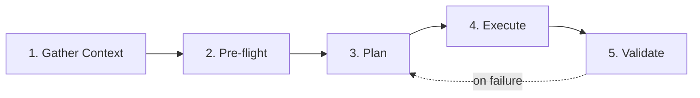

This document is a 5-minute Quickstart for users new to `oh-my-aidlcops` (OMA). We describe the Claude Code environment, though Kiro follows the same flow (invoking skills directly via `.kiro/skills/` symlinks rather than slash commands). See [Kiro Setup](./kiro-setup.md) for Kiro-specific steps.

## Prerequisites

| Item | Version | Notes |
|---|---|---|
| Claude Code CLI | latest stable | `claude --version` |
| jq | 1.6+ | Installation scripts use it for JSON merging |
| bash | 4+ | macOS default 3.2 is outdated; run `brew install bash` |
| AWS credentials | — | `agentic-platform` workflows require EKS, CloudWatch, and S3 access |
| (Optional) Kubernetes CLI | kubectl v1.32+ | Needed for `platform-bootstrap` |

## Lightning Setup (Recommended — Tech Preview)

The fastest path is three lines: `install.sh` + `oma setup` + `oma doctor`.

```bash
curl -fsSL https://raw.githubusercontent.com/aws-samples/sample-oh-my-aidlcops/v0.2.0-preview.1/install.sh | bash
cd my-project
oma setup
oma doctor
```

After these three lines, `.omao/profile.yaml` + `.omao/ontology/*` are generated, and Claude Code / Kiro plugins, MCP servers, and hooks are installed. See [Easy Button](./easy-button.md) for detailed behavior.

> To install with defaults, press ENTER at every prompt.
> For CI, use `OMA_NON_INTERACTIVE=1` with env flags for non-interactive installation.

## Step 1: Register the Marketplace (30 seconds)

Launch Claude Code and enter the native plugin command.

```bash
claude
> /plugin marketplace add https://github.com/aws-samples/sample-oh-my-aidlcops
> /plugin install agentic-platform agenticops aidlc-inception aidlc-construction
```

Verify the installation:

```bash
> /plugin list
# All four plugins should appear as activated.
```

If native marketplace is unavailable or you are offline, manual installation is also supported.

```bash
git clone https://github.com/aws-samples/sample-oh-my-aidlcops
bash oh-my-aidlcops/scripts/install/claude.sh
```

See [Claude Code Setup](./claude-code-setup.md) for manual installation details.

## Step 2: Initialize Your Project (10 seconds)

OMA stores per-project state in `.omao/`. Run this in your project root.

```bash
cd <your-project>
bash <oma-repo>/scripts/init-omao.sh
```

The structure created is as follows:

```
.omao/
├── plans/                # AIDLC artifacts (spec, design, ADR, user stories)
├── state/                # Session checkpoints and active Tier-0 mode
├── notepad.md            # Working notes
├── triggers.json         # Keyword trigger catalog (read by SessionStart hook)
└── project-memory.json   # Per-project persistent context
```

`.omao/` is harness-agnostic, so Claude Code and Kiro share the same files.

## Step 3: First Tier-0 Execution (2 minutes)

Start with the lightest workflow, `/oma:aidlc-loop`, for a single feature AIDLC one-pass.

```bash
> /oma:aidlc-loop "Add anomaly pattern detection rules to user authentication logs"
```

The agent proceeds in this order:

1. **Inception** — Generate `spec.md` and `user-stories.md` in `.omao/plans/`.
2. **Checkpoint 1** — An approval prompt appears for requirements review. Respond with `approve` or `revise`.
3. **Construction** — After approval, sequentially generate `design.md`, `adr-<topic>.md`, test strategy, and implementation diff.
4. **Checkpoint 2** — Design and implementation review checkpoint. Approval and revision are possible here too.
5. **Operations Setup** — The `agenticops` plugin registers Langfuse trace hooks for continuous post-deployment monitoring.

## Step 4: Understanding Checkpoint Structure (1 minute)

OMA checkpoints follow the 5-stage template from [aws-samples/sample-apex-skills](https://github.com/aws-samples/sample-apex-skills).



Each stage stores results in `.omao/state/checkpoint-<n>.json`. You can pause and resume; rollback is performed by restoring `.omao/state/` snapshots.

## Step 5: Switch to Autonomous Mode (1 minute)

For full-loop automation instead of single-pass, use `/oma:autopilot`.

```bash
> /oma:autopilot "Complete the new API endpoint /v1/events/anomaly from planning through operations"
```

`autopilot` runs Inception, Construction, and Operations continuously, requiring user approval only at checkpoints. During the operations phase, `continuous-eval`, `incident-response`, and `cost-governance` skills activate in the background.

To stop anytime, invoke:

```bash
> /oma:cancel
```

## Verify Results

After completing the Quickstart, the following artifacts are generated:

- `.omao/plans/spec.md` — Requirements specification
- `.omao/plans/design.md` — Component design
- `.omao/plans/adr-*.md` — Architecture decision records
- Source code changes (committed to feature branch)
- `.omao/state/session-<id>/` — Session logs and checkpoint results

## Troubleshooting Summary

| Symptom | Root Cause | Fix |
|---|---|---|
| `/plugin marketplace add` fails | Claude Code version unsupported | Run `claude --version` and upgrade |
| `jq: command not found` | jq not installed | `brew install jq` / `apt install jq` |
| `/oma:*` commands not exposed | `~/.claude/commands/oma/` symlink failed | Rerun `bash scripts/install/claude.sh` |
| MCP server connection fails | `uvx` missing or network issue | Run `pipx install uv` and retry |
| Checkpoint stuck waiting | Hook registration missing | See [Claude Code Setup](./claude-code-setup.md) hooks section |

For more detailed troubleshooting, see [Claude Code Setup](./claude-code-setup.md).

## Next Steps

- [Easy Button](./easy-button.md) — Single `oma setup` execution for install, profile, and seed ontology
- [Profile](./profile.md) and [Doctor](./doctor.md) — Project settings and environment health checks
- [Ontology](./ontology.md) and [Harness DSL](./harness-dsl.md) — Runtime domain contracts and DSL
- [Philosophy](./philosophy-aidlc-meets-agenticops.md) — Understand OMA's design premise
- [Tier-0 Workflows](./tier-0-workflows.md) — Deep dive into all 9 Tier-0 commands
- [Keyword Triggers](./keyword-triggers.md) — Auto-invoke commands based on keywords
- [Support Policy](./support-policy.md) and [Telemetry](./telemetry.md) — Tech Preview support scope

## Reference Materials

### Official Documentation
- [Claude Code Plugins](https://docs.anthropic.com/claude/docs/claude-code-plugins) — Claude Code plugin official guide
- [awslabs/aidlc-workflows](https://github.com/awslabs/aidlc-workflows) — AIDLC core workflow repository

### OMA Internal Documentation
- [Introduction](./intro.md) — OMA overview and plugin catalog
- [Claude Code Setup](./claude-code-setup.md) — Manual installation and hook configuration
- [Tier-0 Workflows](./tier-0-workflows.md) — Command reference details
