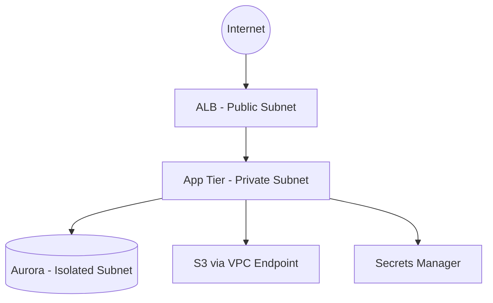

## 언제 사용하나요

- `strategy-decision.md` 가 존재하고 `decided_pattern` 이 Rehost/Replatform/Refactor 중 하나일 때
- Container Orchestration 선택(ECS vs EKS) 과 VPC 토폴로지를 확정해야 할 때
- 매니지드 DB(RDS/Aurora/DynamoDB) 와 저장소(S3) 의 용량·성능·암호화 정책을 설계할 때
- 관측성(CloudWatch/X-Ray/Langfuse) 과 보안 통제(WAF/Shield/GuardDuty) baseline 을 정의할 때

## 언제 사용하지 않나요

- `decided_pattern == Retire | Retain` — 신규 아키텍처 설계 불필요
- `decided_pattern == Repurchase` — SaaS 도입이므로 AWS 상세 아키텍처 미해당
- 기존 To-Be 설계가 이미 존재하고 변경 사항이 없을 때

## 전제 조건

- `.omao/plans/modernization/strategy-decision.md` 존재 및 사용자 승인 완료
- AWS Organization·Account 설계(단일 vs Multi-Account)가 결정됨
- 대상 region 및 AZ 수(최소 2개) 확정

## 절차

### Step 1. Compute Orchestration 선택

aws-samples `container-orchestration-selection.md` 기준으로 평가합니다.

| 조건 | 추천 |
|------|------|
| 팀 DevOps 성숙도 Low-Medium, 단순 Stateless 서비스 | **ECS Fargate** |
| K8s 운영 경험 있음 + 복잡한 Pod 패턴 + Service Mesh | **EKS** |
| 이벤트 기반 간헐 트래픽, 연간 1M 이하 요청 | **Lambda + API Gateway** |
| GPU 추론 워크로드 | **EKS** (GPU NodePool) |

### Step 2. VPC 토폴로지 설계



- **Public Subnet**: ALB/NLB, NAT Gateway 전용
- **Private Subnet**: 애플리케이션 Task/Pod
- **Isolated Subnet**: Aurora, RDS, ElastiCache — NAT 없음, VPC Endpoint 만 허용
- 최소 2 AZ, CIDR /16, 서브넷 /20

### Step 3. Managed Database 선택

| 워크로드 패턴 | 추천 | 근거 |
|--------------|------|------|
| OLTP, 복잡한 JOIN | **Aurora PostgreSQL** | HA, serverless v2 옵션 |
| 단순 키-값, μs latency | **DynamoDB** | 서버리스, 자동 스케일 |
| 기존 Oracle 호환성 | **RDS for Oracle** 또는 **Babelfish** | 마이그레이션 부담 최소 |
| 읽기 집약 + 캐시 | **ElastiCache Redis/Valkey** | 1ms 미만 응답 |

결정 시 기록 항목:

- 인스턴스 클래스(예: `db.r6g.xlarge`) 와 Multi-AZ 여부
- 저장 용량, IOPS 유형
- 암호화(KMS CMK), 백업 보존 기간
- 마이그레이션 도구(DMS, Schema Conversion Tool) 선택

### Step 4. Observability Baseline

| 목적 | 도구 |
|------|------|
| 메트릭 | CloudWatch Metrics + Prometheus (EKS 시) |
| 로그 | CloudWatch Logs + Fluent Bit |
| 트레이싱 | X-Ray (AWS native) 또는 OpenTelemetry → Langfuse (LLM 포함 시) |
| 알람 | CloudWatch Alarms + SNS → PagerDuty/Opsgenie |
| 대시보드 | CloudWatch Dashboards 또는 Grafana |

LLM 추론 경로가 포함된 경우 **Langfuse v3.x** 를 OpenTelemetry 엔드포인트로 구성하여 trace 를 병렬 수집합니다.

### Step 5. 보안 통제

- **네트워크**: Security Group `0.0.0.0/0` 인바운드 금지, ALB/NLB 내부 노출 시 Cognito/OIDC/mTLS
- **IAM**: Least privilege, IRSA (EKS) 또는 Task Role (ECS), 정적 Access Key 금지
- **데이터**: KMS CMK, S3 Block Public Access, VPC Flow Logs 활성화
- **위협 탐지**: GuardDuty, Security Hub, Config Rules
- **WAF**: OWASP Top 10 관리형 규칙 세트 적용

### Step 6. Compliance Matrix

각 규제 항목에 대해 아키텍처 통제를 매핑합니다.

| 규제 | 요구사항 | 아키텍처 통제 |
|------|---------|--------------|
| ISMS-P | 암호화 저장 | KMS CMK (DB, S3, EBS) |
| 전자금융감독규정 | 망분리 | Isolated Subnet + VPC Endpoint |
| PCI-DSS | 카드 정보 격리 | Tokenization + 전용 VPC + WAF |
| SOC 2 | 감사 로그 | CloudTrail + S3 (log archive account) |

### Step 7. Output 산출

`.omao/plans/modernization/to-be-architecture.md` 에 다음 섹션을 포함합니다.

```markdown
# To-Be Architecture
- compute: ECS Fargate (2 AZ, service auto-scaling target 70% CPU)
- vpc: 10.0.0.0/16, subnets (public/private/isolated) × 2 AZ
- database: Aurora PostgreSQL 15 / r6g.xlarge / Multi-AZ / KMS CMK
- storage: S3 (versioning, SSE-KMS, Block Public Access)
- observability: CloudWatch + X-Ray + Langfuse (v3.x)
- security: WAF v2, GuardDuty, Security Hub, IRSA/Task Role
- compliance_matrix: (Step 6 표)
- mermaid_diagram: (Step 2 다이어그램)
- estimated_monthly_cost_usd: 12,400
- next_skill: containerization
```

### Step 8. IaC 스케치 (선택)

`mcp__aws-iac` 를 사용하여 초기 CDK/Terraform 스케치를 생성합니다. 이는 Draft 이며, `containerization` skill 에서 확정됩니다.

## 좋은 예시

- ECS Fargate + Aurora PostgreSQL + CloudWatch + WAF — Replatform 표준 패턴
- EKS + Karpenter + Aurora Serverless v2 + OpenTelemetry — Refactor + 변동 트래픽 대응
- Lambda + API Gateway + DynamoDB — 이벤트 기반 서버리스 재설계

## 나쁜 예시 (금지)

- Public Subnet 에 Aurora 배치 — 망분리 원칙 위반
- `0.0.0.0/0` SG 인바운드 — 회사 정책 위반
- 단일 AZ 구성 — HA 요구사항 충족 불가
- KMS CMK 없이 SSE-S3 만 적용하면서 ISMS-P 대상이라고 주장
- Compliance Matrix 생략하고 아키텍처 결정

## 참고 자료

### 공식 문서
- [AWS Well-Architected Framework](https://docs.aws.amazon.com/wellarchitected/latest/framework/welcome.html) — 5대 기둥
- [Amazon ECS Developer Guide](https://docs.aws.amazon.com/AmazonECS/latest/developerguide/Welcome.html) — ECS 공식 가이드
- [Amazon EKS User Guide](https://docs.aws.amazon.com/eks/latest/userguide/what-is-eks.html) — EKS 공식 가이드
- [AWS Prescriptive Guidance — VPC Design](https://docs.aws.amazon.com/vpc/latest/userguide/vpc-security-best-practices.html) — VPC 보안 Best Practice

### 원천 방법론 (MIT-0)
- [container-orchestration-selection.md (Kiro)](https://github.com/aws-samples/sample-ai-driven-modernization-with-kiro/blob/main/.kiro/skills/aws-practices/container-orchestration-selection.md) — ECS vs EKS 의사결정

### 관련 문서 (내부)
- `../modernization-strategy/SKILL.md` — 선행 skill
- `../containerization/SKILL.md` — 후속 skill
- `/home/ubuntu/workspace/oh-my-aidlcops/plugins/agentic-platform/CLAUDE.md` — LLM 경로가 포함된 아키텍처 연계
