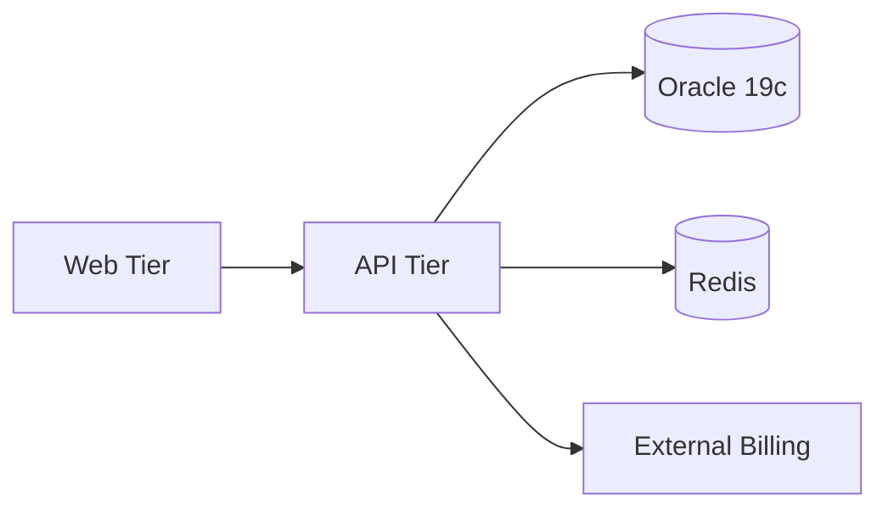

## 언제 사용하나요

- 신규 현대화 프로젝트의 **첫 번째 skill** 로, 대상 시스템의 As-Is 현황을 정량화할 때
- 기존 모놀리식·3-tier·메인프레임·VM 기반 워크로드를 AWS 로 이행하기 전 baseline 이 필요할 때
- 규제 산업(금융·헬스케어·공공) 워크로드의 컴플라이언스 제약을 조기에 식별할 때
- `modernization-strategy` 실행 전에 cost·time·risk 평가 입력값을 수집해야 할 때

## 언제 사용하지 않나요

- 이미 `.omao/plans/modernization/assessment-report.md` 가 최신 상태로 존재하고 입력 스코프에 변화가 없을 때
- 그린필드(신규) 프로젝트 — 이 skill 은 기존 자산 분석이 목적이며, 그린필드는 `aidlc/skills/inception/requirements-analysis` 를 사용
- 단순 라이브러리 버전 업그레이드 — 현대화가 아닌 유지보수 범주는 별도 프로세스로 처리

## 전제 조건

- 대상 워크로드의 소스 코드·배포 스크립트·DB 스키마에 대한 read 권한
- `docs/project-info.md` 또는 동등한 프로젝트 컨텍스트 문서 (선택 — 없으면 Q&A 로 수집)
- `.omao/plans/modernization/` 디렉토리 생성 가능 권한
- (선택) APM 지표(CloudWatch, Datadog, New Relic) 접근 토큰 — 트래픽 패턴 추출에 활용

## 절차

### Step 1. 프로젝트 컨텍스트 수집

- 업무 도메인, 연간 매출 기여도, 사용자 수(DAU/MAU), SLO 목표를 질의 응답 형식으로 확인합니다
- `docs/project-info.md` 존재 시 자동 파싱, 부재 시 5-10 문항으로 수집합니다
- 결과는 `context.md` 초안으로 기록합니다

### Step 2. Application Dependency Graph 작성

- 소스 트리에서 import/require 그래프를 추출합니다
- 외부 시스템 호출 지점(HTTP/gRPC/메시지 큐) 을 모듈별로 태깅합니다
- 결과: Mermaid 다이어그램으로 `assessment-report.md` 에 첨부



### Step 3. Database Schema 분석

- 스키마 파일(`*.sql`, `schema.prisma`, ORM 모델) 에서 테이블·인덱스·트리거·stored procedure 수집
- PII 포함 컬럼, 외래키 복잡도, 파티셔닝 전략을 분류합니다
- 크기(GB), 일일 쓰기 QPS, 읽기 QPS 를 메트릭에서 추출

### Step 4. Traffic Pattern 분석

- ALB/Nginx access log 또는 APM 에서 24시간 단위 QPS, P95 latency, 피크 시각을 집계
- 계절성(일간·주간·월간) 여부 기록
- 동시 세션 수, WebSocket 장기 연결 비율 확인

### Step 5. RTO/RPO·규제 식별

- 비즈니스 요구 RTO(복구 목표 시간), RPO(복구 시점 목표) 수치 확인
- 적용 규제: ISMS-P, PCI-DSS, HIPAA, 전자금융감독규정, SOC 2 여부 체크
- 데이터 주권(region 제약), 암호화 요건(KMS CMK), 감사 로그 보존 기간 기록

### Step 6. Five Lenses 평가

aws-samples `assessment-framework.md` 의 5축을 **High/Medium/Low** 로 점수화합니다.

| Lens | 질문 | 결과 예시 |
|------|------|----------|
| Strategic/Business Fit | 전략적 중요도, 매출 영향 | High |
| Functional Adequacy | 기능 gap, 통합 복잡도 | Medium |
| Technical Adequacy | 기술 부채, 클라우드 준비도 | Low |
| Financial Fit | 현재 TCO, ROI 기간 | Medium |
| Digital Readiness | 팀 스킬, DevOps 성숙도 | Low |

### Step 7. Output 산출

`.omao/plans/modernization/assessment-report.md` 에 다음 섹션을 필수로 포함합니다.

```markdown
# Workload Assessment Report
- slug: ${workload-slug}
- source_type: monolith | microservices | legacy-db
- assessed_at: YYYY-MM-DD
- dependency_graph: (Mermaid)
- database: Oracle 19c / 1.2TB / 8k write-qps
- traffic: peak 12k rps, p95 450ms
- rto_rpo: RTO=4h, RPO=15m
- compliance: [ISMS-P, 전자금융감독규정]
- five_lenses: {strategic: High, functional: Medium, technical: Low, financial: Medium, digital: Low}
- readiness_score: Medium (2.4 / 5.0)
- open_questions: [...]
```

### Step 8. 후속 skill 핸드오프

- `readiness_score >= Medium` → `modernization-strategy` 로 진행
- `readiness_score == Low` → Executive 승인 필요 플래그를 `audit.md` 에 기록 후 중단
- Compliance 위반 가능성 탐지 시 → `risk-discovery` 호출 전제로 기록

## 좋은 예시

- Java EE 모놀리스 + Oracle + Weblogic → dependency graph 에 9개 외부 시스템, 1.2TB DB, RTO 4h, ISMS-P 대상 명시
- Python Django 3-tier + PostgreSQL → traffic pattern 에 일간·주간 계절성 포함, readiness_score Medium

## 나쁜 예시 (금지)

- "현재 시스템이 오래되었다" 같은 정성적 서술만 기재 — Five Lenses 수치 없이 다음 skill 로 넘김
- PII 컬럼 식별 누락 — Step 3 의 PII 분류 생략
- 규제 적용 여부를 "모름" 으로 남기고 진행 — 컷오버 단계에서 재작업 필요
- `.omao/plans/` 대신 `/tmp/` 같은 휘발성 경로에 결과 저장

## 참고 자료

### 공식 문서
- [AWS Modernization Pathways](https://aws.amazon.com/modernization/) — AWS 공식 현대화 개요
- [AWS Well-Architected Framework](https://docs.aws.amazon.com/wellarchitected/latest/framework/welcome.html) — 5대 기둥 평가 기준

### 원천 방법론 (MIT-0)
- [assessment-framework.md (Kiro)](https://github.com/aws-samples/sample-ai-driven-modernization-with-kiro/blob/main/.kiro/skills/aws-practices/assessment-framework.md) — Five Lenses 원본

### 관련 문서 (내부)
- `../../CLAUDE.md` — modernization 플러그인 개요
- `../modernization-strategy/SKILL.md` — 다음 skill (6R 결정)
- `/home/ubuntu/workspace/oh-my-aidlcops/plugins/aidlc/CLAUDE.md` — risk-discovery 통합 포인트
