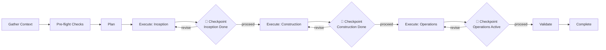

# AIDLC Full Loop Workflow

> **Part of:** [OMA Hub](../oma-hub.md)
> **Commands**: `/oma:autopilot` (전체 루프), `/oma:aidlc-loop` (단일 기능 1회), `/oma:inception` (Phase 1), `/oma:construction` (Phase 2)
> **Plugins**: `aidlc-inception`, `aidlc-construction`, `agenticops`

이 워크플로우는 AIDLC 3단계(Inception, Construction, Operations)를 `aws-samples/sample-apex-skills`의 5-checkpoint 구조로 묶어 실행합니다. 위상 전환은 사람 승인 체크포인트에서만 이루어지며, 에이전트는 각 위상 내부의 반복 작업을 자율적으로 수행합니다.

---

## Access Model

이 워크플로우는 **read-write + checkpoint-gated** 모드로 동작합니다.

- **CAN**: `.omao/plans/` 산출물 생성·수정, 소스 코드 변경, 테스트 실행, PR 초안 생성
- **CAN**: 플러그인 스킬 호출(aidlc-inception, aidlc-construction, agenticops)
- **CANNOT (human gate 없이)**: 위상 전환(Inception→Construction, Construction→Operations), 원격 저장소 푸시, 프로덕션 배포 트리거

모든 위상 전환은 STOP 게이트에서 사용자 응답("proceed" 또는 "revise")을 필요로 합니다.

---

## Stage Transition Overview



루프 전체 진행률은 `.omao/state/sessions/{sessionId}/progress.json`에 기록되며 `/oma:cancel` 호출 시 마지막 체크포인트에서 복구 가능합니다.

---

## Stage 1: Gather Context

진행 전 필수 정보를 모두 수집합니다. 이전 세션이나 `.omao/plans/`에 이미 존재하는 정보는 재질문하지 않습니다.

### Required Context

```
다음 정보를 모두 확보한 다음 Stage 2로 진행합니다.

[ ] 1. Workspace 유형: greenfield / brownfield
[ ] 2. 프로젝트 루트 경로 및 언어·프레임워크
[ ] 3. 대상 기능 요약 (단일 기능 / 전체 프로젝트)
[ ] 4. AIDLC 범위: full (autopilot) / phase-1-only / phase-2-only / single-feature
[ ] 5. 기존 `.omao/plans/` 산출물 존재 여부
[ ] 6. engineering-playbook 스타일 가이드 적용 여부 (한국어 문서 기본)
[ ] 7. 관련 GitHub Issue / JIRA 티켓 링크
[ ] 8. 운영 대상 여부(관측성·평가 후속 필요 여부)
```

### Workspace 유형 판정

```bash
# 한 번만 실행해 greenfield/brownfield 판정에 사용
[ -d .git ] && echo "git repo present"
[ -f package.json ] || [ -f pyproject.toml ] || [ -f go.mod ] && echo "brownfield"
```

**Greenfield**: 새 프로젝트. Inception 산출물을 처음부터 생성합니다.
**Brownfield**: 기존 프로젝트. 먼저 코드베이스를 스캔해 스펙을 역생성한 뒤 변경점만 새 산출물로 제안합니다.

### engineering-playbook 스타일 가이드 로드

한국어 문서가 포함되면 사용자의 engineering-playbook 저장소 `CLAUDE.md`의 Documentation Style Guide를 참조해 문체(경어체), 용어 표기, frontmatter 규약을 준수합니다.

---

## Stage 2: Pre-flight Checks

모든 점검을 통과해야 Stage 3로 진행합니다. 실패 항목은 사용자에게 제시해 명시적 risk acceptance 여부를 확인합니다.

| # | Check | Command / Condition | Action on Fail |
|---|-------|---------------------|----------------|
| 1 | awslabs/aidlc-workflows 설치 | `ls ~/.aidlc-workflows` 또는 플러그인 참조 경로 검증 | 설치 가이드 제시 후 STOP |
| 2 | aidlc-inception 플러그인 존재 | `ls plugins/aidlc-inception/SKILL.md` | 설치 후 재시도 |
| 3 | aidlc-construction 플러그인 존재 | `ls plugins/aidlc-construction/SKILL.md` | 설치 후 재시도 |
| 4 | agenticops 플러그인 존재 (Operations 범위) | `ls plugins/agenticops/SKILL.md` | Operations 범위 제외 옵션 제시 |
| 5 | `.omao/project-memory.json` 로드 | `cat .omao/project-memory.json` | `scripts/init-omao.sh` 실행 유도 |
| 6 | 기존 산출물 충돌 | `.omao/plans/` 중복 파일 해시 비교 | 덮어쓰기/백업 선택 요청 |
| 7 | 테스트 러너 동작 (Construction 범위) | 프로젝트 타입별 기본 명령 (`pytest --collect-only`, `npm test -- --listTests`) | Construction 이전 수정 |
| 8 | Git 저장소 cleanliness | `git status --porcelain` 빈 문자열 | 커밋/스태시 요청 |

### Pre-flight Report

```
+-------------------------------+--------+---------------------+
| Check                         | Status | Details             |
+-------------------------------+--------+---------------------+
| 1. aidlc-workflows            |  P/F   |                     |
| 2. aidlc-inception plugin     |  P/F   |                     |
| 3. aidlc-construction plugin  |  P/F   |                     |
| 4. agenticops plugin          |  P/F   |                     |
| 5. project-memory loaded      |  P/F   |                     |
| 6. no artifact conflicts      |  P/F   |                     |
| 7. test runner OK             |  P/F   |                     |
| 8. git clean                  |  P/F   |                     |
+-------------------------------+--------+---------------------+
```

---

## Stage 3: Plan

AIDLC 전체 범위에 대한 산출물 계획을 한 번에 설계합니다. 범위(`full`/`phase-1-only`/`phase-2-only`/`single-feature`)에 따라 항목을 필터합니다.

### Plan Items

1. **Inception 산출물** — `spec.md`, `stories.md`, `workflow-plan.md`의 섹션 구조 및 유저스토리 개수
2. **Construction 분해** — 컴포넌트 목록, 파일 생성 경로, TDD 테스트 케이스 초안
3. **Operations 계측** — Langfuse 프로젝트 연결, OTel span 속성, SLO 임계값, Ragas 평가셋
4. **체크포인트 게이트** — 각 위상 전환 지점에서 사용자에게 질문할 항목 목록
5. **롤백 전략** — 위상별 실패 시 되돌릴 지점(`.omao/state/sessions/{sessionId}/checkpoint.json`)

계획이 승인되면 Stage 4로 진행합니다.

---

## 🛑 CHECKPOINT — Plan Approval

Before proceeding, confirm:
- [ ] 산출물 목록과 위치(`.omao/plans/`)가 명확한가
- [ ] 범위(full/phase-only/single-feature)가 사용자 의도와 일치하는가
- [ ] 체크포인트별 질문 항목이 사전 합의됐는가

**Agent action**: 계획 요약을 표 형태로 제시하고 대기.
**User action**: 검토 후 "proceed" 또는 "revise" 응답.

---

## Stage 4: Execute

계획된 순서대로 플러그인 스킬을 호출합니다. 각 위상이 끝나면 체크포인트에서 대기합니다.

### 4-A. Inception Phase

aidlc-inception 플러그인 스킬을 다음 순서로 호출합니다.

```
workspace-detection → requirements-analysis → user-stories → workflow-planning
```

산출물:
- `.omao/plans/spec.md`
- `.omao/plans/stories.md`
- `.omao/plans/workflow-plan.md`

### 🛑 CHECKPOINT — Inception Done

Before proceeding, confirm:
- [ ] 스펙에 기능 범위·비기능 요구사항·수용 기준이 포함됐는가
- [ ] 유저스토리가 INVEST 원칙에 부합하는가
- [ ] workflow plan이 Construction 단계의 파일·테스트 경로를 명시하는가

**Agent action**: 3종 산출물 핵심 섹션을 요약.
**User action**: "proceed" 또는 "revise" 응답.

### 4-B. Construction Phase

aidlc-construction 플러그인 스킬을 다음 순서로 호출합니다.

```
component-design → agentic-tdd → code-generation → pr-draft
```

산출물:
- `.omao/plans/design.md` (컴포넌트 설계)
- 소스 코드 변경 및 테스트 파일
- PR 초안(로컬 브랜치, 원격 푸시는 별도 승인 필요)

### 🛑 CHECKPOINT — Construction Done

Before proceeding, confirm:
- [ ] 테스트가 실행 가능하며 통과하는가
- [ ] PR 초안에 ADR·스펙·스토리 링크가 포함됐는가
- [ ] 린트·타입체크·보안 스캔이 통과했는가

**Agent action**: 테스트 결과와 PR diff 요약 제시.
**User action**: "proceed" 또는 "revise" 응답.

### 4-C. Operations Phase

agenticops 플러그인 스킬을 활성화합니다.

```
observability-wiring → continuous-eval-setup → incident-response-setup → cost-governance-setup
```

계측 산출물:
- Langfuse 프로젝트와 API 키 연결
- OTel collector endpoint 설정
- Ragas 평가 데이터셋 및 지표
- SLO/비용 알람 채널

### 🛑 CHECKPOINT — Operations Active

Before proceeding, confirm:
- [ ] Langfuse에 첫 trace가 수신됐는가
- [ ] Ragas 기준 평가가 적어도 1회 실행됐는가
- [ ] SLO/비용 알람이 테스트 발사에 반응하는가

**Agent action**: 초기 trace·평가·알람 스크린샷 또는 로그 발췌 첨부.
**User action**: "proceed" 또는 "revise" 응답.

---

## Stage 5: Validate

전체 루프가 완료됐는지 일괄 점검합니다.

```bash
# 1. Inception 산출물 존재
ls -la .omao/plans/spec.md .omao/plans/stories.md .omao/plans/workflow-plan.md

# 2. 테스트 통과
<project-specific test command>

# 3. Git 상태
git log --oneline -5
git status

# 4. Langfuse trace 수신
<Langfuse API 확인 명령>
```

### Validation Report

```
+-------------------------------+--------+---------------------+
| Validation                    | Status | Details             |
+-------------------------------+--------+---------------------+
| Inception artifacts (3 files) |  P/F   |                     |
| Construction tests pass       |  P/F   |                     |
| PR draft created              |  P/F   |                     |
| Operations telemetry wired    |  P/F   |                     |
| Langfuse trace received       |  P/F   |                     |
| Ragas baseline recorded       |  P/F   |                     |
+-------------------------------+--------+---------------------+
| OVERALL                       |  P/F   | Ready / Action req. |
+-------------------------------+--------+---------------------+
```

실패 항목이 있으면 해당 위상으로 되돌아가 재실행을 제안합니다. 모두 통과하면 `.omao/state/active-mode`를 해제하고 세션을 종료합니다.

---

## 참고 자료

### 공식 문서
- [awslabs/aidlc-workflows](https://github.com/awslabs/aidlc-workflows) — AIDLC 공식 워크플로우
- [aws-samples/sample-apex-skills](https://github.com/aws-samples/sample-apex-skills) — 5-checkpoint 템플릿 원본
- [awslabs/agent-plugins](https://github.com/awslabs/agent-plugins) — 플러그인 JSON Schema

### 관련 문서 (내부)
- [OMA Hub](../oma-hub.md) — 중앙 라우팅 테이블
- [Autopilot 명령](../commands/oma/autopilot.md) — 전체 루프 자율 실행 진입점
- [AIDLC Loop 명령](../commands/oma/aidlc-loop.md) — 단일 기능 1회 순회
- [Platform Bootstrap Workflow](./platform-bootstrap.md) — 인프라 부트스트랩 워크플로우
- [Self-Improving Deploy Workflow](./self-improving-deploy.md) — 피드백 루프 배포
