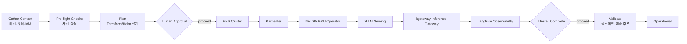

# Platform Bootstrap Workflow

> **Part of:** [OMA Hub](../oma-hub.md)
> **Command**: `/oma:platform-bootstrap`
> **Plugin**: `agentic-platform`
> **Lifecycle**: Day 0 — Build

이 워크플로우는 신규 EKS 클러스터에 Agentic AI Platform 스택을 순서 보장된 5단계로 설치합니다. 각 체크포인트에서 사람 승인 없이 다음 단계로 진행하지 않으며, 설치 의존성(GPU 드라이버 → 서빙 엔진 → 라우팅 → 관측성)을 준수합니다.

---

## Access Model

이 워크플로우는 **read-write + checkpoint-gated + infra-mutating** 모드로 동작합니다.

- **CAN**: 클러스터 읽기, Terraform/eksctl 플랜 생성·표시, Helm 차트 설치 명령 제안
- **CANNOT (명시 승인 없이)**: 실제 `terraform apply`, `eksctl create`, `helm install` 실행
- **CANNOT**: IAM 정책 변경, 프로덕션 클러스터 파괴

모든 mutating 명령은 사용자에게 제시된 뒤 명시적 "proceed" 응답이 있어야 실행됩니다. 에이전트는 진단·계획·가이드·검증에 집중합니다.

---

## Stage Transition Overview



---

## Stage 1: Gather Context

Stage 2로 진행하기 전에 모든 컨텍스트를 확보합니다. MCP 서버(`mcp__eks`, `mcp__aws-pricing`)를 통해 자동 조회 가능한 항목은 자동화합니다.

### Required Context

```
[ ] 1. 대상 AWS 리전 (예: us-west-2, ap-northeast-2)
[ ] 2. 기존 EKS 클러스터 여부 및 이름
[ ] 3. GPU 인스턴스 가용성 조회 결과
       → mcp__eks: 가용영역별 GPU 인스턴스 유형
       → mcp__aws-pricing: p5/p4d/g5/g6 시간당 비용
[ ] 4. 타겟 모델 목록과 크기 (예: Llama 3 70B, Claude 4.7 via Bedrock proxy)
[ ] 5. 예상 동시 추론 QPS 및 피크 사용량
[ ] 6. Langfuse self-hosted 여부 또는 외부 endpoint
[ ] 7. IaC 선호: Terraform / eksctl / Helm-only
[ ] 8. 네트워크 모델: 퍼블릭 VPC 금지, 반드시 ALB/NLB + 인증 경유
```

### GPU 가용성 조회 예

```bash
# mcp__eks (보조 조회용)
# 가용영역별 GPU 인스턴스 타입과 쿼터 확인

# 대표 명령 (사용자 환경에서 실행)
aws ec2 describe-instance-type-offerings \
  --location-type availability-zone \
  --filters "Name=instance-type,Values=p5*,g6*,g5*" \
  --region <region> \
  --query 'InstanceTypeOfferings[].[InstanceType,Location]' \
  --output table
```

---

## Stage 2: Pre-flight Checks

모든 점검을 통과해야 Plan 단계로 진행합니다.

| # | Check | 명령/조건 | Fail 시 조치 |
|---|-------|----------|--------------|
| 1 | IAM 권한 | EKS, EC2, IAM, VPC, Route53, ACM 필요 권한 존재 | 누락 권한 나열 후 STOP |
| 2 | 서비스 쿼터 | p5/g6 인스턴스 쿼터, EIP, ENI 한도 | `mcp__aws-pricing`으로 쿼터 증가 요청 가이드 |
| 3 | KubeConfig 접근 | 기존 클러스터가 있으면 `kubectl get nodes` 동작 | IAM aws-auth 재구성 안내 |
| 4 | Helm v3.x | `helm version` | Helm 설치 가이드 제공 |
| 5 | Security Group 정책 | 0.0.0.0/0 인바운드 금지 (CLAUDE.md 규정) | 퍼블릭 SG 제안 차단 |
| 6 | 도메인·ACM 인증서 | Inference Gateway용 HTTPS 인증서 준비 | 대안: kubectl port-forward |
| 7 | Langfuse 접근 | self-hosted 배포 계획 또는 외부 endpoint 도달성 | 접근 실패 시 네트워크 점검 |
| 8 | Terraform 상태 저장소 | S3+DynamoDB state backend 계획 | state drift 예방 설계 요청 |

### Pre-flight Report

```
+------------------------------+--------+---------------------+
| Check                        | Status | Details             |
+------------------------------+--------+---------------------+
| 1. IAM permissions           |  P/F   |                     |
| 2. Service quotas            |  P/F   |                     |
| 3. KubeConfig access         |  P/F   |                     |
| 4. Helm v3.x                 |  P/F   |                     |
| 5. SG policy (no 0.0.0.0/0)  |  P/F   |                     |
| 6. Domain & ACM cert         |  P/F   |                     |
| 7. Langfuse reachable        |  P/F   |                     |
| 8. Terraform state backend   |  P/F   |                     |
+------------------------------+--------+---------------------+
```

---

## Stage 3: Plan

Terraform(또는 eksctl) 플랜과 Helm 차트 설치 명령을 생성해 사용자에게 제시합니다. 모델 크기와 QPS에 맞춰 노드풀 사이즈를 산정합니다.

### Plan Components

1. **EKS 클러스터 스펙** — K8s 1.32+, managed control plane log 활성화, addon 목록
2. **노드풀 설계**
   - 시스템 노드풀: m6i.large × 3 (AZ 분산)
   - GPU 노드풀: 모델 크기별 인스턴스 선택 (7B→g6.xlarge, 70B→p5.48xlarge 등)
   - Karpenter NodePool 매니페스트 초안
3. **Helm 차트 목록 (설치 순서 보장)**
   1. Karpenter v1.2+
   2. NVIDIA GPU Operator (최신 stable)
   3. vLLM deployment (v0.18+)
   4. kgateway v2.0+ (Inference Gateway CRDs)
   5. Langfuse v3.x (self-hosted or connect external)
4. **네트워킹**
   - ALB + Cognito/OIDC 인증 필수 (퍼블릭 SG 금지)
   - Route53 레코드 + ACM TLS
5. **관측성 계측**
   - OTel collector DaemonSet
   - Langfuse API key 배포 (ExternalSecrets 또는 SealedSecrets)
6. **롤백 계획** — 각 단계별 실패 시 되돌릴 지점

### 🛑 CHECKPOINT — Plan Approval

Before proceeding, confirm:
- [ ] 노드풀 사이즈와 예상 비용(시간당·월간)이 예산에 부합하는가
- [ ] 퍼블릭 Security Group 오픈이 없는가 (0.0.0.0/0 금지)
- [ ] Helm 차트 버전이 2026.04 기준 안정 버전과 일치하는가
- [ ] Langfuse 배포 방식(self-hosted / external)이 확정됐는가

**Agent action**: Terraform plan 요약과 Helm release matrix 제시.
**User action**: "proceed" / "revise".

---

## Stage 4: Execute

의존성 순서대로 설치합니다. 각 단계는 독립적으로 검증된 뒤 다음으로 넘어갑니다.

### 4-1. EKS Cluster

```
terraform apply -target=module.eks     # 또는 eksctl create cluster
```

검증: `aws eks describe-cluster --name <name> --query 'cluster.status'` → ACTIVE
체크포인트: 시스템 노드 Ready 확인.

### 4-2. Karpenter

```bash
helm install karpenter oci://public.ecr.aws/karpenter/karpenter \
  --version v1.2.x --namespace karpenter --create-namespace \
  -f karpenter-values.yaml
```

검증: `kubectl get pods -n karpenter`, NodePool CRD 적용 테스트.

### 4-3. NVIDIA GPU Operator

```bash
helm install gpu-operator nvidia/gpu-operator \
  --namespace gpu-operator --create-namespace \
  -f gpu-operator-values.yaml
```

검증: DCGM DaemonSet Running, `kubectl describe node <gpu-node>` Allocatable nvidia.com/gpu 확인.

### 4-4. vLLM Serving

```bash
helm install vllm-runtime <vllm-chart> \
  --namespace inference --create-namespace \
  -f vllm-values.yaml
```

검증: `/metrics` endpoint, `/v1/models` 응답.

### 4-5. kgateway Inference Gateway

```bash
helm install kgateway oci://<registry>/kgateway --version v2.0.x \
  --namespace gateway-system --create-namespace \
  -f kgateway-values.yaml
kubectl apply -f httproute-vllm.yaml
```

검증: HTTPRoute Accepted, ALB DNS 응답.

### 4-6. Langfuse Observability

```bash
helm install langfuse langfuse/langfuse \
  --namespace observability --create-namespace \
  -f langfuse-values.yaml
```

검증: Langfuse Web UI 접속, API key 발급.

### 🛑 CHECKPOINT — Install Complete

Before proceeding, confirm:
- [ ] 6개 구성요소 모두 Helm release 상태 deployed인가
- [ ] GPU 노드가 Karpenter를 통해 자동 프로비저닝되는가
- [ ] Inference Gateway endpoint가 외부에서 인증 경유로 도달 가능한가
- [ ] Langfuse UI 접속과 API key 발급이 완료됐는가

**Agent action**: 각 release 상태와 endpoint 나열.
**User action**: "proceed" / "revise".

---

## Stage 5: Validate

샘플 추론을 발사하고 Langfuse에 trace가 수신되는지 확인합니다.

```bash
# 1. 모든 컴포넌트 헬스
kubectl get pods -A --field-selector 'status.phase!=Running,status.phase!=Succeeded'

# 2. Inference Gateway 엔드포인트에 샘플 요청
curl -X POST https://<gateway-host>/v1/chat/completions \
  -H "Authorization: Bearer <token>" \
  -H "Content-Type: application/json" \
  -d '{"model":"<model>","messages":[{"role":"user","content":"ping"}]}'

# 3. Langfuse trace 확인
# Langfuse Web UI → Traces 탭 → 최근 trace 존재 여부
```

### Validation Report

```
+------------------------------+--------+---------------------+
| Validation                   | Status | Details             |
+------------------------------+--------+---------------------+
| All pods running             |  P/F   |                     |
| Karpenter scales GPU node    |  P/F   |                     |
| GPU Operator DCGM metrics    |  P/F   |                     |
| vLLM /v1/models responds     |  P/F   |                     |
| Gateway HTTPRoute Accepted   |  P/F   |                     |
| Sample inference succeeded   |  P/F   |                     |
| Langfuse trace received      |  P/F   |                     |
+------------------------------+--------+---------------------+
| OVERALL                      |  P/F   | Operational / Retry |
+------------------------------+--------+---------------------+
```

모두 Pass면 플랫폼 부트스트랩 완료. 다음 단계로 `/oma:agenticops`를 호출해 운영 자동화 모드를 활성화할 수 있습니다.

---

## 참고 자료

### 공식 문서
- [Amazon EKS User Guide](https://docs.aws.amazon.com/eks/latest/userguide/what-is-eks.html) — EKS 기본 개념과 API
- [Karpenter Documentation](https://karpenter.sh/docs/) — 오토스케일러 공식 문서
- [NVIDIA GPU Operator](https://docs.nvidia.com/datacenter/cloud-native/gpu-operator/latest/index.html) — Kubernetes용 GPU 운영자
- [vLLM Documentation](https://docs.vllm.ai/) — 고성능 추론 서빙
- [kgateway Project](https://kgateway.dev/) — Envoy 기반 Inference Gateway
- [Langfuse Self-hosting Guide](https://langfuse.com/self-hosting) — LLM 관측성 오픈소스

### 관련 문서 (내부)
- [OMA Hub](../oma-hub.md) — 중앙 라우팅 테이블
- [Platform Bootstrap 명령](../commands/oma/platform-bootstrap.md) — 명령 정의
- [AIDLC Full Loop Workflow](./aidlc-full-loop.md) — 애플리케이션 루프 워크플로우
- [Self-Improving Deploy Workflow](./self-improving-deploy.md) — 피드백 루프 배포
