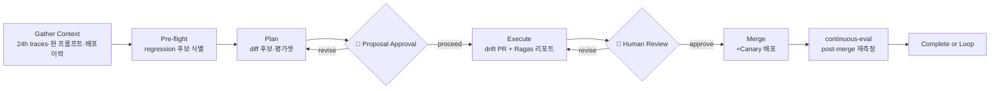

# Self-Improving Deploy Workflow

> **Part of:** [OMA Hub](../oma-hub.md)
> **Commands**: `/oma:self-improving` (1회 실행), `/oma:agenticops` (지속 모드)
> **Plugin**: `agenticops` (self-improving-loop 스킬)
> **Lifecycle**: Day 2 — Operate

이 워크플로우는 운영 중 수집된 Langfuse trace에서 regression candidate를 식별해 프롬프트 또는 스킬 diff를 제안하고, Ragas 평가 리포트를 첨부한 드래프트 PR을 생성합니다. engineering-playbook의 `self-improving-agent-loop.md` ADR 규약을 그대로 구현합니다.

---

## Access Model

이 워크플로우는 **read-heavy + draft-only + human-gated merge** 모드로 동작합니다.

- **CAN**: Langfuse API 조회, 프롬프트·스킬 파일 읽기, diff 생성, Ragas 평가 실행, 드래프트 PR 오픈
- **CAN**: 카나리 배포 매니페스트 제안, 평가 리포트 저장
- **CANNOT (명시 승인 없이)**: 프롬프트·스킬 파일 직접 변경 머지, 프로덕션 롤아웃, 예산 초과 실험 실행

사람은 드래프트 PR 리뷰와 머지 결정에만 개입합니다.

---

## Stage Transition Overview



루프가 지속 모드(`/oma:agenticops` 하위)로 실행될 경우 Complete 이후 자동으로 다음 사이클(Gather Context)로 돌아갑니다. 단일 호출(`/oma:self-improving`)은 1회 실행 후 종료합니다.

---

## Stage 1: Gather Context

지난 사이클 이후 수집된 운영 데이터를 수집합니다.

### Required Context

```
[ ] 1. Langfuse 프로젝트 ID 및 API 키
[ ] 2. 조회 기간 (기본 24h, 주간 루프는 7d)
[ ] 3. 현재 활성 프롬프트·스킬 스냅샷 (git HEAD)
[ ] 4. 최근 배포 이력 (Argo CD / Flux / Helm release 로그)
[ ] 5. 예산·SLO 임계값 (이전 사이클 기준선)
[ ] 6. Ragas 평가 데이터셋 위치
[ ] 7. 카나리 배포 타깃 (트래픽 5~10% 시작)
```

### Data Fetch 예

```bash
# Langfuse trace 조회 (API)
curl -H "Authorization: Bearer $LANGFUSE_SECRET" \
  "https://<langfuse>/api/public/traces?fromTimestamp=$(date -u -d '24 hours ago' --iso-8601=seconds)"

# 현재 프롬프트 파일 확인
git log -1 --pretty=format:%H -- prompts/
```

---

## Stage 2: Pre-flight Checks

regression candidate를 식별하고 개선 루프 실행 조건을 검증합니다.

| # | Check | 조건 | Fail 시 조치 |
|---|-------|------|--------------|
| 1 | Langfuse 접근 | API 응답 200 | 자격 증명·네트워크 점검 |
| 2 | Trace 충분성 | 최소 50개 trace 수집 | 조회 기간 연장 또는 STOP |
| 3 | Regression 신호 | faithfulness ↓ / latency p95 ↑ / cost/request ↑ 중 1개 이상 임계 초과 | 변동 없으면 조용히 종료 |
| 4 | 이전 PR 중복 | 동일 regression에 대한 open PR 여부 | 중복 피하고 기존 PR 링크 제시 |
| 5 | Ragas 환경 | `ragas`/`llama-index-evaluation` 설치 | pip 설치 가이드 |
| 6 | 예산 여유 | 평가 실행 예상 토큰/비용이 잔여 예산 이내 | 범위 축소 또는 STOP |

### Pre-flight Report

```
+------------------------------+--------+---------------------+
| Check                        | Status | Details             |
+------------------------------+--------+---------------------+
| 1. Langfuse reachable        |  P/F   |                     |
| 2. Traces ≥ 50               |  P/F   |                     |
| 3. Regression signal present |  P/F   | 신호 종류 명시       |
| 4. No duplicate PR           |  P/F   |                     |
| 5. Ragas ready               |  P/F   |                     |
| 6. Budget available          |  P/F   |                     |
+------------------------------+--------+---------------------+
```

Check 3에서 신호가 없으면 루프는 조용히 종료합니다. 이는 정상이며 "개선할 것이 없다"는 결론 자체가 가치 있는 결과입니다.

---

## Stage 3: Plan

diff 후보안을 생성합니다. 단일 PR에는 프롬프트 diff 또는 스킬 diff 중 **하나만** 포함해 영향 평가를 단순화합니다.

### Plan Components

1. **Root cause 가설** — regression 시그널(어떤 지표, 어떤 trace 패턴)과 추정 원인
2. **Diff 후보**
   - 프롬프트: system prompt 재구성, few-shot 추가/축소, instruction 명확화
   - 스킬: 도구 호출 순서 변경, 가드레일 추가, skill description 개선
3. **Ragas 평가 설계** — before/after 비교용 샘플 수, 메트릭(faithfulness, answer_relevancy, context_precision)
4. **Canary 배포 계획** — 트래픽 5~10% 시작, 롤백 조건(faithfulness 지표 유지)
5. **성공 기준** — 타깃 메트릭 X% 이상 개선, 비용·latency 회귀 없음

### 🛑 CHECKPOINT — Proposal Approval

Before proceeding, confirm:
- [ ] root cause 가설이 trace 증거로 뒷받침되는가
- [ ] diff 범위가 프롬프트 또는 스킬 중 하나로 한정됐는가
- [ ] Ragas 평가 샘플 수와 예산이 합리적인가
- [ ] 카나리 롤백 기준이 객관적인 지표인가

**Agent action**: 제안서 요약(가설·diff 후보·평가 계획) 제시.
**User action**: "proceed" / "revise".

---

## Stage 4: Execute

드래프트 PR을 생성하고 Ragas 평가 리포트를 첨부합니다.

### 4-1. Diff 생성

```bash
# 브랜치 생성
git checkout -b self-improve/<yyyy-mm-dd>-<short-desc>

# 프롬프트 또는 스킬 파일 수정
# (한 PR은 두 카테고리를 섞지 않는다)
```

### 4-2. Ragas Before/After 평가

```bash
# Before: 현 HEAD 기준 평가
python scripts/run_ragas.py --version main --dataset eval/dataset.jsonl \
  --metrics faithfulness,answer_relevancy,context_precision \
  --output reports/before.json

# After: 새 브랜치 기준 평가
python scripts/run_ragas.py --version self-improve/... --dataset eval/dataset.jsonl \
  --metrics faithfulness,answer_relevancy,context_precision \
  --output reports/after.json

# 비교 리포트 생성
python scripts/compare_ragas.py reports/before.json reports/after.json \
  > reports/comparison.md
```

### 4-3. 드래프트 PR 오픈

```bash
gh pr create --draft \
  --title "self-improve: <short-desc>" \
  --body-file reports/pr-body.md
```

PR body에는 다음을 필수 포함합니다.
- Root cause 가설 및 trace 링크
- Before/after Ragas 비교 표
- Canary 배포 계획과 롤백 조건
- 관련 ADR 링크(`self-improving-agent-loop.md`)

### 🛑 CHECKPOINT — Human Review

Before merge, confirm:
- [ ] Ragas 비교에서 목표 지표가 개선됐는가
- [ ] 회귀(비용·latency·faithfulness 중 하나라도)는 없는가
- [ ] diff가 한 카테고리(프롬프트 OR 스킬)에만 국한되는가
- [ ] 카나리 배포 매니페스트와 롤백 경로가 준비됐는가

**Agent action**: PR URL, Ragas 요약 표, canary diff 제시.
**User action**: GitHub에서 리뷰 후 "approve" / "revise".

---

## Stage 5: Validate

머지 후 카나리 배포 및 post-merge 재측정을 수행합니다.

```bash
# 머지는 사용자가 GitHub UI 또는 CLI에서 수행
gh pr merge <pr-number> --squash

# 카나리 배포 트리거 (Argo Rollouts 또는 Flagger)
kubectl argo rollouts set image <rollout> <container>=<new-image>

# 카나리 진행 모니터링
kubectl argo rollouts get rollout <name>

# continuous-eval 재측정 (agenticops 스킬)
# Langfuse 1시간 trace를 기준으로 자동 수행
```

### Validation Report

```
+------------------------------+--------+---------------------+
| Validation                   | Status | Details             |
+------------------------------+--------+---------------------+
| PR merged                    |  P/F   |                     |
| Canary deployment healthy    |  P/F   | 트래픽 비율           |
| Post-merge Ragas ≥ target    |  P/F   |                     |
| No cost/latency regression   |  P/F   |                     |
| Rollback ready (if needed)   |  P/F   |                     |
+------------------------------+--------+---------------------+
| OVERALL                      |  P/F   | Improved / Rollback |
+------------------------------+--------+---------------------+
```

카나리가 임계 조건을 위반하면 자동 롤백을 제안하고 루프를 재시작합니다. 조건을 모두 만족하면 카나리 비율을 단계적으로 확대합니다.

---

## 참고 자료

### 공식 문서
- [Langfuse API Reference](https://langfuse.com/docs/api) — trace 조회·메트릭 API
- [Ragas Documentation](https://docs.ragas.io/) — RAG 평가 메트릭 라이브러리
- [Argo Rollouts](https://argoproj.github.io/argo-rollouts/) — 프로그레시브 딜리버리

### 논문 / 기술 블로그
- [Self-Refine (NeurIPS 2023)](https://arxiv.org/abs/2303.17651) — 자기 개선 프롬프트 루프
- [LLMOps 자기개선 루프 패턴](https://langfuse.com/blog/) — Langfuse 공식 블로그 모음

### 관련 문서 (내부)
- [OMA Hub](../oma-hub.md) — 중앙 라우팅 테이블
- [Self-Improving 명령](../commands/oma/self-improving.md) — 1회 실행 진입점
- [AgenticOps 명령](../commands/oma/agenticops.md) — 지속 모드 진입점
- [AIDLC Full Loop Workflow](./aidlc-full-loop.md) — 애플리케이션 루프 워크플로우
- [Platform Bootstrap Workflow](./platform-bootstrap.md) — 인프라 부트스트랩
- engineering-playbook `docs/agentic-ai-platform/design-architecture/advanced-patterns/adr-self-improving-loop.md` — ADR
- engineering-playbook `docs/agentic-ai-platform/design-architecture/advanced-patterns/self-improving-agent-loop.md` — 상세 설계
