# Stage-Gated Progression Workflow

> **Part of:** [OMA Hub](../oma-hub.md)
> **Applied by**: `/oma:autopilot`, `/oma:aidlc-loop` (when `stage-gate-strict` mode active)
> **Upstream pattern**: [aws-samples/sample-ai-driven-modernization-with-kiro](https://github.com/aws-samples/sample-ai-driven-modernization-with-kiro)

이 워크플로우는 AIDLC 전체 루프(Inception → Construction → Operations)에 대한 **엄격한 단계 경계 시행** 규칙을 정의합니다. 모든 품질 게이트를 명시적으로 PASS해야 다음 단계로 진행할 수 있으며, 모든 사용자 입력과 의사결정은 verbatim 감사 로그로 기록됩니다.

`stage-gate-strict` 모드는 `/oma:autopilot --strict` 또는 사용자 메시지에 "strict" 키워드가 포함될 때 활성화됩니다.

---

## Overview

Stage-Gated Progression은 AIDLC 3단계(Inception, Construction, Operations)를 5개의 명시적 Stage로 분해하고, 각 Stage 경계에 **필수 통과 게이트**를 배치합니다.

```mermaid
flowchart TB
    S1[Stage 1: Gather Context] --> G1{Quality Gate 1<br/>Context Complete}
    G1 -- PASS --> S2[Stage 2: Pre-flight]
    G1 -- FAIL --> S1
    
    S2 --> G2{Quality Gate 2<br/>Risk Discovery}
    G2 -- PASS --> S3[Stage 3: Plan]
    G2 -- FAIL --> S2
    
    S3 --> G3{Quality Gate 3<br/>Plan Approval}
    G3 -- PASS --> S4[Stage 4: Execute]
    G3 -- FAIL --> S3
    
    S4 --> S4I[Phase: Inception]
    S4I --> G4I{Quality Gate 4-I<br/>Inception Artifacts}
    G4I -- PASS --> S4C[Phase: Construction]
    G4I -- FAIL --> S4I
    
    S4C --> G4C{Quality Gate 4-C<br/>Tests Pass}
    G4C -- PASS --> S4O[Phase: Operations]
    G4C -- FAIL --> S4C
    
    S4O --> G4O{Quality Gate 4-O<br/>Telemetry Active}
    G4O -- PASS --> S5[Stage 5: Validate]
    G4O -- FAIL --> S4O
    
    S5 --> G5{Quality Gate 5<br/>All Gates Green}
    G5 -- PASS --> Z[Complete]
    G5 -- FAIL --> S4
    
    style G1 fill:#ffcccc
    style G2 fill:#ffcccc
    style G3 fill:#ffcccc
    style G4I fill:#ffcccc
    style G4C fill:#ffcccc
    style G4O fill:#ffcccc
    style G5 fill:#ffcccc
```



### 핵심 원칙

1. **Anti-Skip Rule**: 게이트를 PASS하지 않으면 다음 Stage로 진행할 수 없습니다. 에이전트가 게이트를 우회하거나 묵시적으로 건너뛰는 것은 금지됩니다.
2. **Verbatim Audit Logging**: 모든 사용자 입력, 승인/거부 결정, 게이트 통과 여부는 ISO 타임스탬프와 함께 `.omao/state/audit-trail.md`에 verbatim으로 기록됩니다.
3. **Mandatory Risk Discovery**: Construction → Operations 전환 전에 `risk-discovery` 스킬을 반드시 실행해야 합니다.
4. **Quality Gates Pre-definition**: Stage 3(Plan) 시점에 모든 게이트의 통과 기준을 사전 정의하고 사용자 승인을 받습니다.

---

## Stage 1: Gather Context

AIDLC 전체 루프를 시작하기 전에 필요한 모든 컨텍스트를 구조화된 형식으로 수집합니다.

### Input Requirements

```yaml
workspace_type: greenfield | brownfield
project_root: /absolute/path/to/project
language_stack: [python, typescript, go, java, ...]
aidlc_scope: full | inception-only | construction-only | operations-only | single-feature
feature_summary: "단일 기능 설명 또는 전체 프로젝트 목표"
engineering_playbook: true | false  # 한국어 문서 스타일 가이드 적용 여부
issue_links: ["https://github.com/.../issues/123", ...]
operations_required: true | false   # Operations phase 관측성·평가 필요 여부
```

### Structured Intake Template

에이전트는 `structured-intake` 스킬을 호출해 다음 템플릿을 사용자에게 제시합니다.

```markdown
## Project Context Intake

**Workspace Type**: [ ] Greenfield / [ ] Brownfield
**Project Root**: 
**Language/Framework**: 
**AIDLC Scope**: [ ] Full / [ ] Inception Only / [ ] Construction Only / [ ] Operations Only / [ ] Single Feature
**Feature Summary**:

**Existing Artifacts** (check if present):
- [ ] `.omao/plans/spec.md`
- [ ] `.omao/plans/stories.md`
- [ ] `.omao/plans/workflow-plan.md`
- [ ] `.omao/plans/design.md`

**Engineering Playbook**: [ ] Apply Korean 경어체 style guide
**Issue Links**: 
**Operations Scope**: [ ] Observability required / [ ] Evaluation required / [ ] Incident response required
```

사용자가 템플릿을 채우지 않으면 에이전트는 Q&A 모드로 전환해 대화형으로 정보를 수집합니다.

### Audit Log Entry

```markdown
## [Stage 1: Gather Context] — 2026-04-22T03:15:42Z

**User input (verbatim)**:
> workspace_type: brownfield
> project_root: /home/ubuntu/workspace/my-agentic-app
> language_stack: [python, fastapi]
> aidlc_scope: full
> feature_summary: "Add semantic caching layer to LLM inference gateway"
> engineering_playbook: true
> issue_links: ["https://github.com/org/repo/issues/456"]
> operations_required: true

**Context validation**: PASS (all required fields present)
**Proceeding to**: Stage 2 (Pre-flight)
```

### Quality Gate 1: Context Complete

**Pass Criteria**:
- [ ] 모든 `Input Requirements` 필드가 채워져 있음
- [ ] `project_root`가 실제 존재하며 읽기 가능
- [ ] `aidlc_scope`가 명시적으로 선택됨
- [ ] brownfield인 경우 `.git` 디렉토리 또는 주요 소스 파일 존재 확인

**Fail Action**: Stage 1로 되돌아가 누락된 정보를 재요청합니다.

---

## Stage 2: Pre-flight

위험 발견(Risk Discovery)과 사전 점검을 수행합니다. 모든 체크가 PASS하거나 사용자가 명시적으로 risk acceptance를 승인해야 Stage 3로 진행합니다.

### Mandatory Checks

| # | Check | Command / Validation | Fail Action |
|---|-------|----------------------|-------------|
| 1 | aidlc-workflows 설치 | `ls ~/.aidlc-workflows` 또는 플러그인 경로 검증 | 설치 가이드 제시 후 STOP |
| 2 | 필수 플러그인 존재 | `ls .claude/plugins/aidlc-inception` 등 | 설치 후 재시도 |
| 3 | `.omao/project-memory.json` 로드 | `cat .omao/project-memory.json` | `scripts/init-omao.sh` 실행 유도 |
| 4 | Git 저장소 cleanliness | `git status --porcelain` (빈 출력 필요) | 커밋/스태시 요청 |
| 5 | 테스트 러너 동작 | 프로젝트별 명령(`pytest --collect-only`) | Construction 이전 수정 |
| 6 | 기존 산출물 충돌 | `.omao/plans/` 파일 해시 비교 | 덮어쓰기/백업 선택 요청 |

### Risk Discovery (Mandatory)

에이전트는 `risk-discovery` 스킬을 호출해 다음 12가지 위험 카테고리를 평가합니다.

1. **Architecture Risks** — 레거시 종속성, 단일 장애점, 확장성 제약
2. **Data Risks** — 데이터 마이그레이션 복잡도, 무결성 검증
3. **Security Risks** — 인증/인가 격차, 비밀 관리, 컴플라이언스
4. **Integration Risks** — 외부 시스템 종속성, API 버전 불일치
5. **Performance Risks** — 응답 시간 SLA, 병목 지점
6. **Testing Risks** — 테스트 커버리지 부족, 테스트 환경 미구성
7. **Deployment Risks** — 롤백 전략 부재, 다운타임 영향
8. **Operational Risks** — 관측성 격차, 런북 부재
9. **Team Risks** — 지식 사일로, 온보딩 문서 부족
10. **Compliance Risks** — 규제 요구사항 미충족(SOC2, ISMS-P 등)
11. **Cost Risks** — 예상 비용 초과, 리소스 낭비
12. **Timeline Risks** — 일정 지연 요인, 블로커 존재

각 카테고리는 **High / Medium / Low / None** 중 하나로 평가되며, High 위험은 반드시 완화 계획을 포함해야 합니다.

### Audit Log Entry

```markdown
## [Stage 2: Pre-flight] — 2026-04-22T03:18:15Z

**Pre-flight checks**:
1. aidlc-workflows installed: PASS
2. aidlc-inception plugin: PASS
3. aidlc-construction plugin: PASS
4. agenticops plugin: PASS
5. project-memory loaded: PASS
6. no artifact conflicts: PASS
7. test runner OK: PASS
8. git clean: PASS

**Risk Discovery Summary**:
- Architecture Risks: Medium (legacy FastAPI 0.95 → 0.115+ migration needed)
- Integration Risks: High (external LLM provider rate limits not handled)
- Performance Risks: Medium (no caching layer, cold start latency)
- Security Risks: Low (existing auth via OAuth2)
- [other categories]: Low/None

**High-risk mitigation plan**:
- Integration Risks: Add retry logic with exponential backoff + fallback provider

**User approval (verbatim)**:
> "Proceed. Mitigation plan approved."

**Quality Gate 2**: PASS
**Proceeding to**: Stage 3 (Plan)
```

### Quality Gate 2: Risk Discovery PASS

**Pass Criteria**:
- [ ] `risk-discovery` 스킬이 실행됨
- [ ] 12가지 카테고리 모두 평가됨
- [ ] High 위험에 대한 완화 계획이 문서화됨
- [ ] 사용자가 위험 평가 결과를 승인함

**Fail Action**: High 위험에 대한 완화 계획을 추가하거나, 사용자가 명시적으로 risk acceptance를 선언할 때까지 Stage 2에서 대기합니다.

---

## Stage 3: Plan

AIDLC 전체 범위에 대한 산출물 계획과 **Quality Gates 사전 정의**를 수행합니다.

### Plan Components

1. **Inception Artifacts Plan**
   - `spec.md` 섹션 구조(Overview, Requirements, Acceptance Criteria, Non-functional Requirements)
   - `stories.md` 유저스토리 개수 및 우선순위
   - `workflow-plan.md` 컴포넌트·파일·테스트 경로

2. **Construction Breakdown**
   - 컴포넌트 목록 및 책임
   - 생성/수정할 파일 경로
   - TDD 테스트 케이스 초안
   - 예상 변경 범위(LoC, 파일 수)

3. **Operations Instrumentation**
   - Langfuse 프로젝트 연결 정보
   - OTel span 속성 설계
   - SLO 임계값(응답 시간, 에러율, 처리량)
   - Ragas 평가 데이터셋 구성

4. **Quality Gates Definition**
   - Gate 1 (Context): 필수 필드 완성도
   - Gate 2 (Pre-flight): Risk discovery + 사전 점검
   - Gate 3 (Plan): 사용자 계획 승인
   - Gate 4-I (Inception): 산출물 3종 생성 + INVEST 원칙
   - Gate 4-C (Construction): 테스트 통과 + 린트/타입체크
   - Gate 4-O (Operations): 텔레메트리 수신 + Ragas 기준 평가
   - Gate 5 (Validate): 전체 게이트 재검증

5. **Rollback Strategy**
   - 각 위상 실패 시 되돌릴 체크포인트
   - `.omao/state/sessions/{sessionId}/checkpoint.json` 스냅샷 주기

### Audit Log Entry

```markdown
## [Stage 3: Plan] — 2026-04-22T03:22:30Z

**Plan Summary**:
- Inception artifacts: spec.md (5 sections), stories.md (8 stories), workflow-plan.md
- Construction: 4 components, 12 files (8 new, 4 modified), 24 test cases
- Operations: Langfuse project "my-agentic-app", OTel spans (cache_hit, cache_miss, llm_call), SLO (p95 < 500ms, error_rate < 1%)

**Quality Gates Pre-defined**:
- Gate 4-I: [ ] spec.md contains NFRs / [ ] 8 stories follow INVEST / [ ] workflow-plan.md has file paths
- Gate 4-C: [ ] 24 tests pass / [ ] mypy + ruff pass / [ ] no High CVEs
- Gate 4-O: [ ] Langfuse receives first trace / [ ] Ragas faithfulness > 0.8 / [ ] SLO alert test passes

**User approval (verbatim)**:
> "Plan approved. Proceed to execution."

**Quality Gate 3**: PASS
**Proceeding to**: Stage 4 (Execute)
```

### Quality Gate 3: Plan Approval

**Pass Criteria**:
- [ ] 산출물 목록과 위치가 명확함
- [ ] Quality Gates 통과 기준이 사전 정의됨
- [ ] 롤백 전략이 문서화됨
- [ ] 사용자가 계획을 승인함

**Fail Action**: 계획 요약을 표 형태로 제시하고 사용자 피드백에 따라 수정합니다. 승인될 때까지 Stage 3에서 대기합니다.

---

## Stage 4: Execute

AIDLC 3단계(Inception, Construction, Operations)를 순차 실행하며, 각 단계 전환 시 해당 Quality Gate를 검증합니다.

### Phase 4-I: Inception

aidlc-inception 플러그인 스킬을 다음 순서로 호출합니다.

```
workspace-detection → requirements-analysis → user-stories → workflow-planning
```

**산출물**:
- `.omao/plans/spec.md`
- `.omao/plans/stories.md`
- `.omao/plans/workflow-plan.md`

### Quality Gate 4-I: Inception Artifacts

**Pass Criteria** (Stage 3 Plan에서 사전 정의):
- [ ] `spec.md`에 Overview, Requirements, Acceptance Criteria, NFRs 섹션 존재
- [ ] `stories.md`에 INVEST 원칙을 따르는 유저스토리 존재(최소 1개 이상)
- [ ] `workflow-plan.md`에 컴포넌트·파일·테스트 경로 명시
- [ ] 모든 산출물이 engineering-playbook 스타일 가이드 준수(경어체, frontmatter 등)

**Audit Log Entry**:
```markdown
## [Stage 4-I: Inception] — 2026-04-22T03:30:00Z

**Artifacts generated**:
- `.omao/plans/spec.md` (982 lines, 5 sections)
- `.omao/plans/stories.md` (8 stories, priority labeled)
- `.omao/plans/workflow-plan.md` (4 components, 12 file paths)

**Quality Gate 4-I validation**:
- [ ] spec.md contains NFRs: PASS
- [ ] 8 stories follow INVEST: PASS
- [ ] workflow-plan.md has file paths: PASS

**User approval (verbatim)**:
> "Inception artifacts look good. Proceed to Construction."

**Quality Gate 4-I**: PASS
**Proceeding to**: Phase 4-C (Construction)
```

**Fail Action**: FAIL 항목을 사용자에게 제시하고 수정 후 재검증합니다. PASS할 때까지 Phase 4-C로 진행하지 않습니다.

---

### Phase 4-C: Construction

aidlc-construction 플러그인 스킬을 다음 순서로 호출합니다.

```
component-design → agentic-tdd → code-generation → pr-draft
```

**산출물**:
- `.omao/plans/design.md`
- 소스 코드 변경(신규/수정 파일)
- 테스트 파일
- PR 초안(로컬 브랜치, 원격 푸시는 별도 승인 필요)

### Quality Gate 4-C: Tests Pass

**Pass Criteria** (Stage 3 Plan에서 사전 정의):
- [ ] 모든 테스트가 실행 가능하며 통과(`pytest`, `npm test` 등)
- [ ] 린트·타입체크 통과(`mypy`, `ruff`, `eslint` 등)
- [ ] 보안 스캔에서 High 취약점 없음(`bandit`, `safety`, `npm audit`)
- [ ] PR 초안에 ADR·스펙·스토리 링크 포함
- [ ] 코드 변경이 workflow-plan.md의 예상 범위 내

**Audit Log Entry**:
```markdown
## [Stage 4-C: Construction] — 2026-04-22T03:45:20Z

**Code changes**:
- 8 files created, 4 files modified (312 lines added, 47 lines removed)
- 24 test cases added (100% pass)

**Quality Gate 4-C validation**:
- [ ] 24 tests pass: PASS
- [ ] mypy + ruff pass: PASS
- [ ] no High CVEs: PASS (1 Medium, accepted)
- [ ] PR draft links: PASS (ADR-023, spec.md, stories.md linked)

**User approval (verbatim)**:
> "Construction complete. Proceed to Operations."

**Quality Gate 4-C**: PASS
**Proceeding to**: Phase 4-O (Operations)
```

**Fail Action**: 테스트 실패, 린트 에러, High 취약점 발견 시 해당 항목을 수정하고 재검증합니다. PASS할 때까지 Phase 4-O로 진행하지 않습니다.

---

### Phase 4-O: Operations

agenticops 플러그인 스킬을 활성화합니다.

```
observability-wiring → continuous-eval-setup → incident-response-setup → cost-governance-setup
```

**계측 산출물**:
- Langfuse 프로젝트 연결 및 API 키
- OTel collector endpoint 설정
- Ragas 평가 데이터셋 및 지표
- SLO/비용 알람 채널

### Quality Gate 4-O: Telemetry Active

**Pass Criteria** (Stage 3 Plan에서 사전 정의):
- [ ] Langfuse에 첫 trace 수신됨(실제 API 호출 후 검증)
- [ ] Ragas 기준 평가가 최소 1회 실행됨(faithfulness, answer_relevancy 등)
- [ ] SLO 알람이 테스트 발사에 반응함(CloudWatch, Prometheus, PagerDuty 등)
- [ ] 비용 추적 대시보드가 초기 데이터 표시(AWS Cost Explorer, Langfuse 토큰 비용 등)

**Audit Log Entry**:
```markdown
## [Stage 4-O: Operations] — 2026-04-22T04:10:05Z

**Observability setup**:
- Langfuse project: "my-agentic-app" (trace ID: tr_abc123, received at 04:09:32Z)
- OTel spans: cache_hit, cache_miss, llm_call (instrumented in 4 files)
- Ragas eval: faithfulness=0.87, answer_relevancy=0.92 (1 eval run, 10 samples)
- SLO alert: test event sent, Slack notification received (04:09:55Z)

**Quality Gate 4-O validation**:
- [ ] Langfuse receives first trace: PASS
- [ ] Ragas faithfulness > 0.8: PASS (0.87)
- [ ] SLO alert test passes: PASS

**User approval (verbatim)**:
> "Operations telemetry is active. Proceed to validation."

**Quality Gate 4-O**: PASS
**Proceeding to**: Stage 5 (Validate)
```

**Fail Action**: 텔레메트리 수신 실패, Ragas 기준 미달, 알람 미동작 시 해당 항목을 수정하고 재검증합니다. PASS할 때까지 Stage 5로 진행하지 않습니다.

---

## Stage 5: Validate

전체 루프가 완료됐는지 **모든 Quality Gates를 재검증**합니다.

### Validation Checklist

```bash
# 1. Inception 산출물 존재
ls -la .omao/plans/spec.md .omao/plans/stories.md .omao/plans/workflow-plan.md

# 2. Construction 테스트 통과
pytest  # 또는 프로젝트별 테스트 명령

# 3. Git 상태 확인
git log --oneline -5
git status

# 4. Langfuse trace 수신 확인
# Langfuse API 또는 대시보드 확인 명령

# 5. Ragas 평가 결과 확인
# Ragas CLI 또는 스크립트 실행

# 6. SLO 알람 동작 확인
# CloudWatch/Prometheus/PagerDuty 로그 확인
```

### Validation Report

```markdown
+----------------------------------------+--------+---------------------+
| Validation                             | Status | Details             |
+----------------------------------------+--------+---------------------+
| Gate 1: Context Complete               |  P/F   |                     |
| Gate 2: Risk Discovery PASS            |  P/F   |                     |
| Gate 3: Plan Approval                  |  P/F   |                     |
| Gate 4-I: Inception Artifacts          |  P/F   |                     |
| Gate 4-C: Tests Pass                   |  P/F   |                     |
| Gate 4-O: Telemetry Active             |  P/F   |                     |
| Gate 5: All Gates Green                |  P/F   |                     |
+----------------------------------------+--------+---------------------+
| OVERALL                                |  P/F   | Ready / Action req. |
+----------------------------------------+--------+---------------------+
```

### Audit Log Entry

```markdown
## [Stage 5: Validate] — 2026-04-22T04:15:30Z

**Validation results**:
- Gate 1: PASS
- Gate 2: PASS
- Gate 3: PASS
- Gate 4-I: PASS
- Gate 4-C: PASS
- Gate 4-O: PASS

**Overall**: PASS

**Session complete**:
- `.omao/state/active-mode` cleared
- Audit trail saved to `.omao/state/audit-trail.md`
- Session ID: sess_abc123, duration: 1h 0m 30s

**Next actions**:
- Push PR to remote: `git push origin feature/semantic-caching`
- Review PR: https://github.com/org/repo/pull/789
- Monitor Langfuse dashboard: https://langfuse.example.com/project/my-agentic-app
```

### Quality Gate 5: All Gates Green

**Pass Criteria**:
- [ ] Gate 1, 2, 3, 4-I, 4-C, 4-O가 모두 PASS 상태
- [ ] 테스트가 여전히 통과함(재실행 후 확인)
- [ ] Git 상태가 clean하거나 PR 브랜치로 변경사항이 커밋됨
- [ ] Langfuse trace가 최근 5분 내 수신됨
- [ ] Ragas 평가 결과가 사전 정의된 임계값 이상

**Fail Action**: 실패한 게이트를 사용자에게 제시하고 해당 Stage로 되돌아가 재실행을 제안합니다. 모든 게이트가 GREEN이 될 때까지 세션을 종료하지 않습니다.

---

## Anti-Skip Rules

Stage-Gated Progression의 핵심 규칙은 **게이트를 PASS하지 않으면 다음 Stage로 진행할 수 없다**는 것입니다.

### Prohibited Behaviors

1. **Silent Skip**: 게이트 결과를 사용자에게 알리지 않고 다음 Stage로 진행
2. **Assumption-based Skip**: "사용자가 승인했을 것"이라 가정하고 게이트 체크를 생략
3. **Partial Validation**: 게이트 Pass Criteria 중 일부만 검증하고 PASS 처리
4. **Unapproved Rollback**: 게이트 FAIL 시 사용자 승인 없이 이전 Stage로 되돌아가거나 자동 재시도

### Mandatory Behaviors

1. **Explicit Gate Status**: 모든 게이트 검증 후 "Quality Gate X: PASS/FAIL" 메시지 출력
2. **Verbatim User Input**: 승인/거부 결정은 사용자 입력을 verbatim으로 audit log에 기록
3. **Wait for Approval**: 게이트 FAIL 시 사용자에게 "proceed" 또는 "revise" 응답을 명시적으로 요청하고 대기
4. **No Auto-progression**: 게이트 PASS 후에도 사용자가 "proceed" 응답을 할 때까지 다음 Stage로 자동 진행 금지

### Example (Correct Behavior)

```markdown
## Quality Gate 2: Risk Discovery PASS

**Risk Discovery Summary**:
- Architecture Risks: Medium
- Integration Risks: High (mitigation plan: add retry logic)
- [other categories]: Low/None

**Mitigation plan**:
- Add exponential backoff retry for external LLM provider (max 3 retries, 2s base delay)

**Gate status**: PENDING user approval

❓ Please review the risk discovery results and mitigation plan.
   Type "proceed" to continue to Stage 3 (Plan), or "revise" to update the mitigation plan.
```

### Example (Prohibited Behavior)

```markdown
## Risk Discovery Complete

Risks identified. Proceeding to planning stage...

❌ VIOLATION: 게이트 통과 여부를 명시하지 않음, 사용자 승인 없이 진행
```

---

## Mandatory Audit Logging

모든 Stage 전환과 게이트 검증은 `.omao/state/audit-trail.md`에 **ISO 타임스탬프**와 함께 기록됩니다.

### Audit Log Format

```markdown
## [Stage X: <Stage Name>] — <ISO 8601 timestamp>

**<Event Type>**:
<Details>

**User input (verbatim)**:
> <User's exact message, quoted>

**Quality Gate X**: PASS/FAIL
**Proceeding to**: <Next Stage>
```

### Required Log Entries

1. **Stage Start**: 각 Stage 시작 시 타임스탬프와 입력 컨텍스트
2. **Gate Validation**: 모든 Pass Criteria 검증 결과
3. **User Approval**: 사용자 승인/거부 결정(verbatim quote)
4. **Stage Transition**: 다음 Stage로 진행할 때 이전 Stage 요약
5. **Session Complete**: 전체 루프 종료 시 세션 ID, 소요 시간, 최종 산출물 목록

### Audit Trail Example

```markdown
# AIDLC Stage-Gated Progression Audit Trail
Session ID: sess_abc123
Started: 2026-04-22T03:15:42Z
Completed: 2026-04-22T04:15:30Z
Duration: 59m 48s

---

## [Stage 1: Gather Context] — 2026-04-22T03:15:42Z

**User input (verbatim)**:
> workspace_type: brownfield
> project_root: /home/ubuntu/workspace/my-agentic-app
> aidlc_scope: full
> feature_summary: "Add semantic caching layer to LLM inference gateway"

**Quality Gate 1**: PASS
**Proceeding to**: Stage 2 (Pre-flight)

---

## [Stage 2: Pre-flight] — 2026-04-22T03:18:15Z

**Pre-flight checks**: 8/8 PASS
**Risk Discovery Summary**: 2 High, 3 Medium, 7 Low/None

**User approval (verbatim)**:
> "Proceed. Mitigation plan approved."

**Quality Gate 2**: PASS
**Proceeding to**: Stage 3 (Plan)

---

[... 이하 생략 ...]
```

### Audit Integrity

- **Immutable**: 감사 로그는 덮어쓰거나 삭제하지 않습니다. 새 세션은 새 파일(`.omao/state/audit-trail-{sessionId}.md`)을 생성합니다.
- **Verbatim Quotes**: 사용자 입력은 편집하거나 요약하지 않고 원본 그대로 blockquote로 기록합니다.
- **No Redaction**: 민감한 정보(API 키 등)가 포함된 경우 사용자에게 경고하지만, 로그 자체는 수정하지 않습니다. 사용자가 별도로 `.gitignore`에 추가해야 합니다.

---

## Configuration

### Activate Stage-Gate-Strict Mode

다음 방법 중 하나로 활성화합니다.

1. **Command-line flag**:
   ```
   /oma:autopilot --strict
   ```

2. **Keyword trigger**:
   사용자 메시지에 "strict" 또는 "stage-gate-strict" 키워드 포함
   ```
   "Run autopilot in strict stage-gate mode"
   ```

3. **Session state**:
   ```bash
   echo '{"mode": "stage-gate-strict"}' > .omao/state/active-mode
   ```

### Deactivate

```
/oma:cancel
```
또는
```bash
rm .omao/state/active-mode
```

### Check Status

```bash
cat .omao/state/active-mode
# Output: {"mode": "stage-gate-strict", "session_id": "sess_abc123", "current_stage": 3}
```

---

## 참고 자료

### 공식 문서
- [aws-samples/sample-ai-driven-modernization-with-kiro](https://github.com/aws-samples/sample-ai-driven-modernization-with-kiro) — 상류 워크플로우 패턴(risk discovery, quality gates, audit rules)
- [awslabs/aidlc-workflows](https://github.com/awslabs/aidlc-workflows) — AIDLC 공식 워크플로우
- [aws-samples/sample-apex-skills](https://github.com/aws-samples/sample-apex-skills) — 5-checkpoint 템플릿

### 관련 Skills (내부)
- [audit-trail](../../plugins/agenticops/skills/audit-trail.md) — 감사 로그 작성 스킬
- [risk-discovery](../../plugins/agenticops/skills/risk-discovery.md) — 12-카테고리 위험 발견 방법론
- [quality-gates](../../plugins/agenticops/skills/quality-gates.md) — Quality Gate 프레임워크
- [structured-intake](../../plugins/aidlc-inception/skills/structured-intake.md) — 구조화된 컨텍스트 수집 템플릿

### 관련 문서 (내부)
- [aidlc-full-loop.md](./aidlc-full-loop.md) — AIDLC 전체 루프 워크플로우(stage-gate-strict 비활성 시 기본 동작)
- [OMA Hub](../oma-hub.md) — 중앙 라우팅 테이블
- [Autopilot 명령](../commands/oma/autopilot.md) — 전체 루프 자율 실행 진입점
